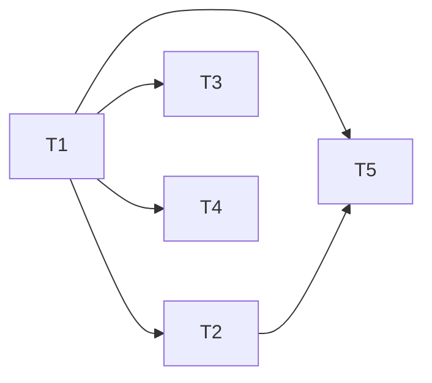

# Package the pipeline as a Claude Code plugin — scope

> HANDOFF.md next-step 2. Not a design doc for the pipeline itself — a scope
> for turning `agents/` into an installable plugin, so a project adds the
> five subagents with one command instead of the symlink-or-copy dance in
> `agents/README.md`.

**Status:** Scoped, not started · **Scoped:** September 2026

---

## 1. What a Claude Code plugin actually needs

Confirmed against the current Claude Code plugin docs (`/docs/en/plugins`,
`/docs/en/plugins-reference`):

- A plugin is any directory with a `.claude-plugin/plugin.json` manifest at
  its root (`name`, `description`, optional `version`/`author`). **Only**
  `plugin.json` goes inside `.claude-plugin/`; every other component
  (`agents/`, `skills/`, `commands/`, `hooks/`, `.mcp.json`, …) lives at the
  plugin root, not nested under `.claude-plugin/`.
- `agents/*.md` at the plugin root is already the exact format Claude Code
  expects for custom agents — no rewrite needed. This repo's `agents/`
  directory already matches that layout byte for byte.
- Installing a plugin for local/team use needs no marketplace: `claude
  --plugin-dir /path/to/design-docs-template` (or a `.zip`/URL of it) loads
  it directly. A marketplace (`marketplace.json` + `/plugin marketplace add`)
  is only needed for one-command discovery/install by strangers, e.g.
  publishing to `claude-community`.
- Skills are model-invoked Markdown (`skills/<name>/SKILL.md`); a plugin can
  optionally ship one to give the pipeline a slash-command-style entry point
  (`/design-docs-template:pipeline`), separate from the five agents
  themselves.

## 2. Recommendation: plugin root = repo root

The repo root already holds `agents/` in the right shape. The only thing
missing is `.claude-plugin/plugin.json`. Nesting a separate `plugin/`
subdirectory and copying or symlinking `agents/` into it would add a second
copy to keep in sync for no benefit — Claude Code ignores directories it
doesn't recognize (`lib/`, `template.html`, `DESIGN_DOC_INSTRUCTIONS.md`
stay exactly where they are and are simply inert extra files from the
plugin loader's point of view).

**Consequence:** installing this repo as a plugin also ships `lib/`
(including the ~2.7 MB vendored `mermaid.min.js`) and both HTML templates
into the installing project's plugin cache. This is already true today for
anyone who clones the repo to use the symlink method in `agents/README.md`,
so it is not a new cost — just naming it here so it isn't a surprise during
review.

## 3. Tasks

### T-1 — Add the plugin manifest
**Goal:** create `.claude-plugin/plugin.json` at repo root (`name`,
`description`, `version: "1.0.0"`, `author`).
**Touches:** `.claude-plugin/plugin.json`
**Depends on:** none
**Satisfies:** minimum viable plugin — everything below is additive.
**Acceptance:** `claude plugin validate .` passes with no errors.
**Size:** S

### T-2 — Smoke-test local load
**Goal:** confirm all five agents load and are invocable under
`--plugin-dir`.
**Touches:** none (verification only)
**Depends on:** T-1
**Acceptance:** `claude --plugin-dir .` in a scratch project shows all five
agents (`design-doc-author`, `requirements-author`, `tasks-planner`,
`spec-validator`, `html-suite-builder`) under `/context` → Custom Agents;
each is invocable by name.
**Size:** S

### T-3 — Document the plugin install path
**Goal:** add a "Plugin (recommended)" install method to `agents/README.md`
above the existing symlink/copy instructions: `claude --plugin-dir
/path/to/design-docs-template`, or (once T-5 lands) `/plugin marketplace
add` + `/plugin install`. Keep the symlink/copy method for projects that
want the files vendored in-tree instead of plugin-managed.
**Touches:** `agents/README.md`
**Depends on:** T-1
**Acceptance:** a reader who has never used Claude Code plugins can follow
the new section and get the five agents loaded without also reading the
plugin docs.
**Size:** S

### T-4 — Orchestrator skill (optional — see Open questions §5.2)
**Goal:** add `skills/design-pipeline/SKILL.md` that walks a user through
the five-stage pipeline by name, so `/design-docs-template:design-pipeline`
is a discoverable single entry point instead of requiring the user to know
all five agent names up front.
**Touches:** `skills/design-pipeline/SKILL.md`
**Depends on:** T-1
**Acceptance:** invoking the skill on a fresh brief prompts the user toward
`design-doc-author` first and names the four downstream stages; it does not
duplicate the agents' own instructions, only points at them.
**Size:** M

### T-5 — Marketplace entry (optional — see Open questions §5.3)
**Goal:** publish a `marketplace.json` (in this repo or a separate
marketplace repo) so the pipeline installs via `/plugin marketplace add
jcallaway82/design-docs-template` + `/plugin install` instead of requiring
a local clone path.
**Touches:** `.claude-plugin/marketplace.json` (new) or a new repo,
depending on the answer to §5.3
**Depends on:** T-1, T-2
**Acceptance:** a project with no local clone of this repo can install the
plugin by marketplace name alone.
**Size:** M

## 4. Dependency graph

## 5. Open questions

1. **Plugin `name`.** `plugin.json`'s `name` becomes the skill-invocation
   namespace (`/​<name>:skill`) if T-4 is built. `design-docs-template`
   reads oddly as an installed tool's namespace (it's a repo name, not a
   product name) — worth deciding the name now, before T-4 exists, to avoid
   renaming a published namespace later. Resolved by the user.
2. **Is T-4 (orchestrator skill) worth building?** The five agents are
   already independently invocable by name and each prints its own "next
   step" line (per every `agents/*.md`'s "When done" section) — a skill
   would mainly help a first-time user who doesn't know the pipeline exists
   yet. Resolved by the user; skip if the agent descriptions already
   surface well enough in `/agents` browsing.
3. **Is T-5 (marketplace) in scope now, or later?** `--plugin-dir` (T-1–T-3)
   already gets any project that has cloned or added this repo to a working
   one-command-ish install. A marketplace only matters for install-by-name
   without a local clone. Resolved by the user — recommend deferring T-5
   until there's a second consumer who isn't already working in this repo.
4. **Versioning policy.** `plugin.json`'s `version` is the update signal to
   installers (bump-and-users-get-updates). This repo doesn't currently
   version anything (the Markdown docs have their own `Version:` front
   matter, unrelated). Decide whether `plugin.json`'s version tracks
   `agents/` changes specifically or the whole repo. Resolved by the user;
   default assumption if unanswered: track the whole repo, bump on any
   `agents/`, `lib/`, or template change.

## 6. Changelog

- **v1.0 — September 2026** — Initial scope.
