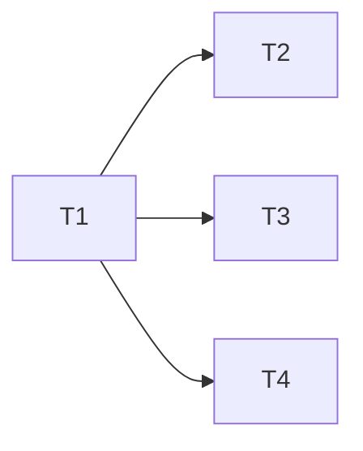

# Package the pipeline as a Claude Code plugin — scope

> HANDOFF.md next-step 2. Not a design doc for the pipeline itself — a scope
> for turning `agents/` into an installable plugin, so a project adds the
> five subagents with one command instead of the symlink-or-copy dance now
> documented in `README.md`.

**Status:** T-1–T-4 done · T-5 declined · plugin `name` still open (§5.1) ·
**Scoped:** September 2026 · **Updated:** September 2026

---

## 1. What a Claude Code plugin actually needs

Confirmed against the current Claude Code plugin docs (`/docs/en/plugins`,
`/docs/en/plugins-reference`):

- A plugin is any directory with a `.claude-plugin/plugin.json` manifest at
  its root (`name`, `description`, optional `version`/`author`). **Only**
  `plugin.json` goes inside `.claude-plugin/`; every other component
  (`agents/`, `skills/`, `commands/`, `hooks/`, `.mcp.json`, …) lives at the
  plugin root, not nested under `.claude-plugin/`.
- `agents/*.md` at the plugin root is already the exact format Claude Code
  expects for custom agents — no rewrite needed. This repo's `agents/`
  directory already matches that layout byte for byte.
- Installing a plugin for local/team use needs no marketplace: `claude
  --plugin-dir /path/to/design-docs-template` (or a `.zip`/URL of it) loads
  it directly. A marketplace (`marketplace.json` + `/plugin marketplace add`)
  is only needed for one-command discovery/install by strangers, e.g.
  publishing to `claude-community`.
- Skills are model-invoked Markdown (`skills/<name>/SKILL.md`); a plugin can
  optionally ship one to give the pipeline a slash-command-style entry point
  (`/design-docs-template:pipeline`), separate from the five agents
  themselves.

## 2. Recommendation: plugin root = repo root

The repo root already holds `agents/` in the right shape. The only thing
missing is `.claude-plugin/plugin.json`. Nesting a separate `plugin/`
subdirectory and copying or symlinking `agents/` into it would add a second
copy to keep in sync for no benefit — Claude Code ignores directories it
doesn't recognize (`lib/`, `template.html`, `DESIGN_DOC_INSTRUCTIONS.md`
stay exactly where they are and are simply inert extra files from the
plugin loader's point of view).

**Consequence:** installing this repo as a plugin also ships `lib/`
(including the ~2.7 MB vendored `mermaid.min.js`) and both HTML templates
into the installing project's plugin cache. This is already true today for
anyone who clones the repo to use the symlink method in `README.md`, so it
is not a new cost — just naming it here so it isn't a surprise during
review.

**Correction found while building T-1/T-2:** the plugin loader scans
`agents/` *recursively* and treats every `.md` file it finds as an agent
definition — not just the five top-level agent files this scope assumed.
`agents/README.md` (as it existed when this was scoped) and
`agents/templates/*.md` both got picked up as broken pseudo-agents in the
`--plugin-dir` smoke test. Fixed by relocating both: `templates/` moved to
the repo root, and `agents/README.md`'s content merged into the top-level
`README.md`. `agents/` now holds exactly the five agent files and nothing
else — see `HANDOFF.md`'s "Plugin packaging T-1–T-3" entry for the full
account.

## 3. Tasks

### T-1 — Add the plugin manifest — done
**Goal:** create `.claude-plugin/plugin.json` at repo root (`name`,
`description`, `version: "1.0.0"`, `author`).
**Touches:** `.claude-plugin/plugin.json`
**Depends on:** none
**Satisfies:** minimum viable plugin — everything below is additive.
**Acceptance:** `claude plugin validate .` passes with no errors.
**Size:** S
**Result:** shipped with `name: "design-docs-template"` (Open question 1
picked a default to unblock this, still open — see §5.1) and no `author`
field (none was available to state truthfully; it's optional). Validates
clean except two benign warnings: "no author" (as above), and `CLAUDE.md`
"not loaded as project context" — correct behavior, since `CLAUDE.md` is
this repo's own contributor guidance, not something meant to ship as
context to a consuming project.

### T-2 — Smoke-test local load — done
**Goal:** confirm all five agents load and are invocable under
`--plugin-dir`.
**Touches:** none (verification only)
**Depends on:** T-1
**Acceptance:** `claude --plugin-dir .` in a scratch project shows all five
agents (`design-doc-author`, `requirements-author`, `tasks-planner`,
`spec-validator`, `html-suite-builder`) under `/context` → Custom Agents;
each is invocable by name.
**Size:** S
**Result:** first run surfaced 4 extra broken pseudo-agents (`README`,
`templates:DESIGN.template`, `templates:REQUIREMENTS.template`,
`templates:TASKS.template`) — see the "Correction" note in §2. Fixed by
relocating `agents/README.md` and `agents/templates/`; re-ran clean, exactly
the five real agents listed, each invocable by its namespaced name
(`design-docs-template:<agent-name>`).

### T-3 — Document the plugin install path — done
**Goal:** add a "Plugin (recommended)" install method above the existing
symlink/copy instructions: `claude --plugin-dir /path/to/design-docs-template`,
or (once T-5 lands) `/plugin marketplace add` + `/plugin install`. Keep the
symlink/copy method for projects that want the files vendored in-tree
instead of plugin-managed.
**Touches:** `README.md` (not `agents/README.md` — that file no longer
exists; its content is merged into the top-level `README.md`, see §2's
correction note)
**Depends on:** T-1
**Acceptance:** a reader who has never used Claude Code plugins can follow
the new section and get the five agents loaded without also reading the
plugin docs.
**Size:** S
**Result:** added an "Installing the agents in a project" section to
`README.md` covering all four methods (plugin, symlink ×2 platforms, copy),
plus the reason `templates/` and the former `agents/README.md` had to move.

### T-4 — Orchestrator skill — done
**Goal:** add `skills/design-pipeline/SKILL.md` that walks a user through
the five-stage pipeline by name, so `/design-docs-template:design-pipeline`
is a discoverable single entry point instead of requiring the user to know
all five agent names up front.
**Touches:** `skills/design-pipeline/SKILL.md`
**Depends on:** T-1
**Acceptance:** invoking the skill on a fresh brief prompts the user toward
`design-doc-author` first and names the four downstream stages; it does not
duplicate the agents' own instructions, only points at them.
**Size:** M
**Result:** `claude plugin validate .` clean (no new warnings). Live smoke
test: `--plugin-dir` + `/design-docs-template:design-pipeline` with a fresh
brief drove straight into `design-doc-author`, which produced a complete
`DESIGN.md` and stopped only at that sandbox's own write-permission prompt
— unrelated to the skill. Built with the current default plugin name
(`design-docs-template`); Open question §5.1 (rename before the namespace
is "published") is still open and now genuinely live, since a skill
invocation name now depends on it.

### T-5 — Marketplace entry — declined
**Goal:** publish a `marketplace.json` (in this repo or a separate
marketplace repo) so the pipeline installs via `/plugin marketplace add
jcallaway82/design-docs-template` + `/plugin install` instead of requiring
a local clone path.
**Depends on:** T-1, T-2
**Size:** M
**Result:** user declined 2026-09-10 (Open question §5.3, now closed).
`--plugin-dir` (T-1–T-3) covers every consumer of a template repo, who by
definition already has it cloned or vendored — a marketplace entry buys
install-by-name for a stranger with no local copy, which isn't this repo's
use case. Not built.

## 4. Dependency graph

T-5 dropped from the graph — declined, see its entry in §3.

## 5. Open questions

1. **Plugin `name`.** Now live, not hypothetical: T-4 shipped with
   `design-docs-template` as the namespace, so
   `/design-docs-template:design-pipeline` is the invocation today. It
   still reads oddly as a namespace (a repo name, not a product name).
   Renaming later means updating `.claude-plugin/plugin.json`'s `name` and
   nothing else — the skill/agent files don't hardcode it — so the cost of
   deferring is low, but it should still be a deliberate choice rather than
   drift. Resolved by the user.
2. ~~Is T-4 (orchestrator skill) worth building?~~ **Closed 2026-09-10:
   built.** See its entry in §3.
3. ~~Is T-5 (marketplace) in scope now, or later?~~ **Closed 2026-09-10:
   declined.** `--plugin-dir` (T-1–T-3) already covers this repo's actual
   consumers.
4. **Versioning policy.** `plugin.json`'s `version` is the update signal to
   installers (bump-and-users-get-updates). This repo doesn't currently
   version anything (the Markdown docs have their own `Version:` front
   matter, unrelated). Decide whether `plugin.json`'s version tracks
   `agents/` changes specifically or the whole repo. Resolved by the user;
   default assumption if unanswered: track the whole repo, bump on any
   `agents/`, `lib/`, or template change.

## 6. Changelog

- **v1.3 — September 2026** — T-4 built (orchestrator skill); bumped
  `plugin.json` to 1.1.0 per open question §5.4's default versioning
  assumption (a new skill is a substantive plugin change).
- **v1.2 — September 2026** — T-5 declined by the user; open question §5.3
  closed.
- **v1.1 — September 2026** — T-1–T-3 built; recorded the `agents/`
  recursive-scan correction and its fix.
- **v1.0 — September 2026** — Initial scope.
