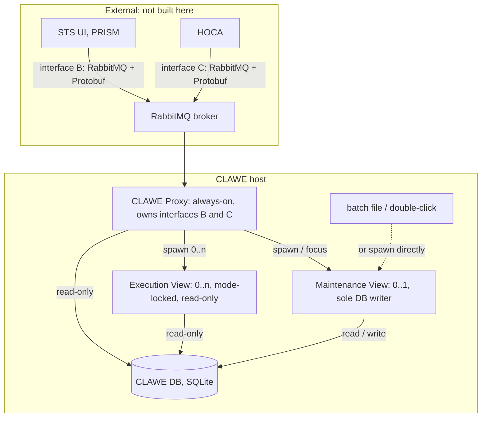
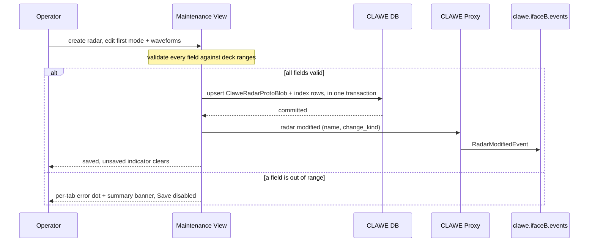
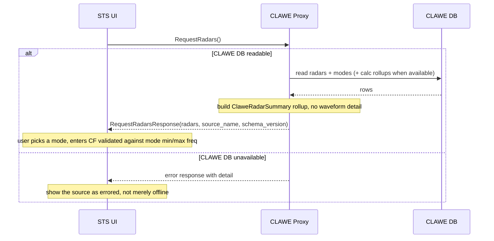
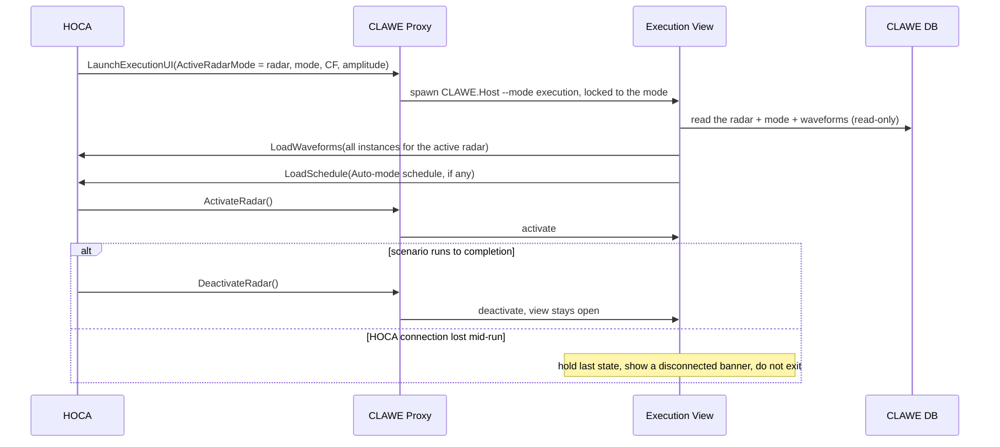

# CLAWE UI — Design

> The *what* and the *why* for the CLAWE Interactive Emitters App: a standalone application that authors and runs closed-loop CLAWE radars, which STS drives over the network to play inside static scenarios.

> **Rendered version:** `CLAWE_Design.html` (in the design-doc suite). This Markdown file is the
> editable source — regenerate the HTML after a substantive change. If the two disagree, this file
> wins.

**Version:** 1.6 · **Status:** Draft · **Updated:** September 2026

---

## Table of contents

1. [Overview](#1-overview)
2. [Goals & non-goals](#2-goals--non-goals)
3. [Context & constraints](#3-context--constraints)
4. [Architecture](#4-architecture)
5. [Components](#5-components)
6. [Key flows](#6-key-flows)
7. [Design decisions](#7-design-decisions)
8. [Data model](#8-data-model)
9. [Failure modes & recovery](#9-failure-modes--recovery)
10. [Open questions](#10-open-questions)
11. [Changelog](#11-changelog)

---

## 1. Overview

A **CLAWE radar** is a closed-loop radar generator: it adapts its transmitted waveform in response to jamming. The **CLAWE Interactive Emitters App** (this project, "CLAWE UI") is a standalone C#/WPF/.NET 10 application — its own process, own executable, own SQLite database — that lets an operator author these radars (a radar, its modes, and each mode's waveforms with a nine-category modifier stack) and run them. **STS** (the existing PRISM application) connects to CLAWE UI over the network to fetch its radar catalogue and add a live CLAWE radar to a static scenario; **HOCA**, the hardware-abstraction layer, connects to run an assigned radar mode against STS hardware.

CLAWE UI is **not** a PRISM plugin. It is architecturally independent of STS — it shares no runtime code — but is deliberately built to look, feel, and be organised like it: the same WPF visual language (`PRISM.UI` conventions, copied not referenced), the same database patterns (EF Core + SQLite + a protobuf blob, like `PRISM.Database`), and the same tiered-editor UX (`PRISM.EmitterMaker`).

At runtime CLAWE UI is not one window but a small set of cooperating processes: an always-on **CLAWE Proxy** that owns the network connections and launches views on request; a singleton **Maintenance View** for authoring (the sole writer to the database); and `0..n` **Execution Views**, each locked to one assigned radar mode. Between them sits **CLAWE DB**, the SQLite store.

This document is the design hub. It sits above three sibling documents that carry the depth: [`CLAWE_Data_Schema.html`](CLAWE_Data_Schema.html) (the approved persisted data model), [`CLAWE_Interface_B.html`](CLAWE_Interface_B.html) (the STS ↔ CLAWE network contract — a **normative extension** of this design; requirements may trace to it for interface-B/C message detail), and [`CLAWE_Data_Model_Browser.html`](CLAWE_Data_Model_Browser.html) (an interactive reference for every proto message). It feeds [`REQUIREMENTS.md`](REQUIREMENTS.md) (numbered testable requirements traced back to this design) and, in place of a `TASKS.md`, the existing [`CLAWE_UI_Iterative_Timeline.md`](CLAWE_UI_Iterative_Timeline.md) (a 12-iteration delivery plan). Progress against that plan is tracked in [`Iteration_Review.md`](Iteration_Review.md).

## 2. Goals & non-goals

**Goals**

- Author a complete CLAWE radar offline: a `ClaweRadarInstance` with `1..N` `ClaweRadarModeInstance` children, each with a full constraint envelope and `0..N` `ClaweWaveformInstance` children carrying the nine-category modifier stack.
- Enforce every field range from the requirements deck (slides 27–32) at the point of entry — the editor is the validation authority, not a downstream consumer.
- Show computed waveform metrics live while authoring (CPI duration, processing gain, eclipsing, range ambiguity, velocity ambiguity) and make them browsable across a mode's hundreds-to-thousands of waveforms.
- Present CLAWE's radar catalogue to STS over interface B as a flattened `ClaweRadarSummary` rollup, and publish a `RadarModifiedEvent` on every write so STS refreshes on change rather than polling.
- Run an assigned radar mode in a locked Execution View launched by HOCA over interface C, with live signal previews and RDI/target visualisation.
- Match STS's visual language and database design patterns closely enough that an STS user recognises the app.

**Non-goals**

- Being a PRISM plugin, or sharing any runtime assembly with PRISM. Look-and-feel parity is achieved by **copying** `PRISM.UI` tokens and controls, not by project reference.
- Authoring CW (continuous-wave) waveforms in v1. The `BaseWaveform.CW` enum value ships for interface-B vocabulary stability; no deck specifies CW parameters, so there is no CW editor.
- Supporting `RadarModeType` values other than `TTR` in v1. `Search`, `TAR`, and `Missile` are visible-but-disabled in the editor.
- Implementing HOCA, STEEM, the SPARTA SW Simulator, or the STS static-scenario builder. CLAWE UI is a peer to those, not a host for them.
- Standing up or operating the RabbitMQ broker. CLAWE UI is a client of it.
- Coordinating maintenance-mode editing across hosts. The single-writer rule is enforced per host; multi-host CLAWE means independent proxies and independent databases.
- Being a general emitter tool. CLAWE UI models closed-loop CLAWE radars specifically; STS's `PRISM.EmitterBuilder` remains the tool for ordinary emitters.

## 3. Context & constraints

- **Existing systems this design must fit:**
  - **Legacy SPARTA** (`sparta/`, its own git repo) — a working C# CLAWE implementation. It is the field-naming and behaviour source of truth: `sparta/Components/libSPARTASimulation/src/SPARTASimulation/Components/CLAWE/` (controllers, views, processing-path components) and `sparta/Components/libSPARTABase/src/SPARTABase/DataObjects/SMDLObjects/CLAWE/` (`ClaweControlSettings.cs`, `CLAWEProcPathSettings.cs`, `ClaweEASettings.cs`). CLAWE UI's data model is approved as-is; reconciling *names and behaviour* against legacy is still open (OQ-5).
  - **STS / PRISM** (`SPARTA Test System/PRISM/`, .NET 10, `PRISM.slnx`) — the pattern and reference source, never a host. `PRISM.UI` is the visual look-and-feel source (not `Design Template/`, which generates HTML docs). `PRISM.Database` (EF Core + SQLite + protobuf-compiled schemas, `emitters.db`) is the DB-pattern source. `PRISM.EmitterMaker` (assembly namespace `PRISM.EmitterBuilder` — a historical quirk, left alone) is the closest editor-UX analog; its `Design/GraphsAndFieldsReview.md` documents known gaps (missing validation, NaN/divide-by-zero guards, no dirty-tracking) to avoid inheriting. `PRISM.StaticScenarioBuilder` is the STS-side surface that talks to interface B. `PRISM.Host/Services/HocaLiteService.cs` (TCP/JSON + NetMQ/ZMQ + Protobuf) is a working STS ↔ HOCA reference.
- **Platform:** C#/WPF/.NET 10; SQLite via EF Core; Protocol Buffers (proto3, namespace `Clawe.V1`); RabbitMQ (AMQP 0-9-1) for interfaces B and C. Windows desktop. Fully offline — no CDN, no network dependency for authoring.
- **Scale targets:** hundreds to thousands of `ClaweWaveformInstance` rows per mode; on the order of a few hundred radars per `CLAWE DB` (take **500 radars** as the design figure for interface-B response sizing). The per-mode waveform count drives the storage and rollup design (§7, DD-2 and DD-9) — filtering thousands of waveforms must not deserialize a blob per row.
- **Hard constraints:**
  - The data model (`ClaweRadarInstance` / `ClaweRadarModeInstance` / `ClaweWaveformInstance`) was reviewed and **approved as-is** on 2026-08-18. No schema *concept* changes are pending; two cardinality *narrowings* (§7, DD-7 and DD-8) are live in code, both lead-confirmed.
  - Must look and feel like the STS UI and follow similar DB design patterns.
  - Interface B and C transport is specified as TCP + RabbitMQ + Protobuf (`STS SW Interface Descriptions.pptx`).
- **Assumptions** (each one, if wrong, changes the design):
  - STS UI, CLAWE UI, and HOCA may run on the same machine or different machines. Nothing may assume same-host access to another component's database or filesystem.
  - Each CLAWE host runs exactly one proxy and one `CLAWE DB`.
  - A radar always has `1..N` modes and never zero (confirmed with the lead, matches STS).
  - Waveform authoring happens only in the singleton Maintenance View; every other process opens `CLAWE DB` read-only.

## 4. Architecture

CLAWE UI is a set of processes on one host. The **CLAWE Proxy** starts at user logon and stays up. It is a headless process in the user's session, not a Windows Service, so it can open views on the user's desktop (DD-21). It holds the RabbitMQ connections for **interface B** (STS UI ↔ CLAWE UI) and **interface C** (CLAWE UI ↔ HOCA), and a read-only connection to **CLAWE DB** so it can answer `RequestRadars()` without a view running. It launches views on request and brings a running Maintenance View forward rather than starting a second one.

The **Maintenance View** is a single-purpose WPF window for authoring radars, modes, and waveforms. It is a **singleton** per host — enforced by a system-wide named mutex (`Global\CLAWE_UI_Maintenance`) plus a write-owner row in the database — and it is the **only** process that writes `CLAWE DB`. It is launched either by the proxy (over interface B, via `LaunchMaintenanceUiCommand`) or directly by a batch file or double-click. Either way it registers with the proxy over a local named pipe and reports each committed radar change there, which the proxy publishes as `RadarModifiedEvent` (DD-20).

An **Execution View** is a single-purpose window locked to one assigned `ClaweRadarModeInstance`. HOCA launches it over interface C (`LaunchExecutionUI(ActiveRadarMode)`). The operator may add and edit waveform *instances* within the lock but cannot change the radar/mode capabilities or constraints. `0..n` may run at once; none write the database.

**CLAWE DB** is the SQLite store: one file per host, at `%LocalAppData%\CLAWE\clawe.db`, in WAL mode. The canonical data is a single serialized `ClaweRadarInstance` protobuf blob per radar; the relational tables are a thin queryable index over it (§8).

**STS UI**, **HOCA**, and the **RabbitMQ broker** are external. STS is the client on interface B. HOCA is the hardware-abstraction layer between the software components and STS hardware; it drives execution over interface C. The broker carries all interface-B and interface-C traffic. `STS SW Interface Descriptions.pptx` catalogues six interfaces A–F; only B and C touch CLAWE.

## 5. Components

CLAWE UI ships as **eight production .NET projects** — seven exist today (through delivery iteration 4); `CLAWE.Calc` is planned — plus a test project per production project, and a dev-only `tools/CLAWE.TestClient`. The runtime components above map onto them as follows.

### CLAWE Proxy

- **Responsibility:** own the interface-B and interface-C RabbitMQ connections, answer `RequestRadars()` from a read-only DB connection, launch and track Maintenance and Execution Views, and enforce the singleton-maintenance rule.
- **Interfaces:**
  - Consumes `clawe.ifaceB.rpc.<source>` (STS requests/commands; the source name is the endpoint STS registered, OQ-11) and interface-C control messages from HOCA.
  - Publishes `RadarModifiedEvent` to the `clawe.ifaceB.events` fanout exchange.
  - Serves the local `clawe-proxy` named pipe: views register there, and the Maintenance View reports committed changes (DD-20).
  - Asks the Maintenance View to come forward over the `clawe-maintenance` pipe, and spawns `CLAWE.Host --mode maintenance` and `CLAWE.Host --mode execution` processes.
- **Owns:** the map of running views, its own single-instance mutex (`Global\CLAWE_Proxy`), and a read-only `CLAWE DB` connection. No persisted state of its own.
- **Projects:** `CLAWE.Proxy` (the process), `CLAWE.Messaging` (the RabbitMQ transport — the only project with a broker client), `CLAWE.Contracts` (`ClaweRadarSummary` builder, interface-B names and versions, the local pipe protocol). The message types are compiled from `clawe_interface_b.proto` and `clawe_local.proto` in `CLAWE.Proto`.

### Maintenance View

- **Responsibility:** author and edit radars, modes, and waveforms with full field validation; find an existing radar through a search / filter overlay; and show live waveform-calculation metrics while authoring.
- **Interfaces:** exposes a WPF editor UI (`RadarListPage`, `RadarEditorView`, a mode-pill strip, and a slide-out `RadarFilterPanel` — a debounced text search over name / description / alternate name, mirroring STS's `EmitterFilterPanel`, extensible with frequency / PRI range sections once rollup data exists); writes through `ClaweDatabaseService` — per-call repositories and, for the footer Save, one unit of work (DD-18); on every committed write, reports the change to the proxy, which publishes `RadarModifiedEvent`.
- **Owns:** all writes to `CLAWE DB`. Holds `Global\CLAWE_UI_Maintenance` and the write-owner row for its lifetime.
- **Projects:** `CLAWE.Host` (WPF executable, composition root, dialogs), `CLAWE.UI` (theme tokens copied from `PRISM.UI`, reusable controls, `ScottPlot` charting + a copied `GraphThemeHelper`).

### Execution View

- **Responsibility:** run one assigned radar mode — operator-in-the-loop or cognitive — with signal previews, RDI scopes, and a target table; add/edit waveform instances within the mode lock.
- **Interfaces:** consumes interface-C messages relayed by the proxy (`ActivateRadar`, `DeactivateRadar`); produces interface-C messages to HOCA (`LoadWaveforms`, `LoadSchedule`); opens `CLAWE DB` read-only.
- **Owns:** transient run state (active waveform, schedule position). No persisted state.
- **Projects:** `CLAWE.Host --mode execution` and `CLAWE.UI`. The dockable graph-window shell (planned, built against the STS "RTSA window" pattern once located — OQ-4) is a set of WPF controls **inside `CLAWE.UI`**, not a separate project — the production project count stays eight.

### CLAWE DB

- **Responsibility:** persist the canonical radar data and a thin queryable index over it; evolve its schema through versioned patch steps.
- **Interfaces:** `ClaweDatabaseService` over an `IClaweDbContextFactory` — a writer (the Maintenance View) or read-only (`Mode=ReadOnly`: the proxy, Execution Views) — with a context per operation and `IClaweUnitOfWork` for multi-step writes (DD-18); `ClaweDbContext` (EF Core, `EnsureCreatedAsync` init, `ApplySchemaUpdatesAsync` — versioned steps recorded in a `ClaweSchemaVersion` table, v1 through v8 today).
- **Owns:** `ClaweRadar`, `ClaweRadarAlternateName`, `ClaweRadarMode`, `ClaweRadarModeWaveform`, `ClaweRadarProtoBlob` (the canonical serialized `ClaweRadarInstance`), `ClaweWriteOwner` (FR-35), and — planned — `ClaweWaveformCalcRollup`.
- **Projects:** `CLAWE.Database` (context, entities, repositories, `Google.Protobuf` runtime-only), `CLAWE.Proto` (proto compilation via `Grpc.Tools`, no EF — so non-database consumers use the `Clawe.V1` types without an EF dependency).

### Waveform Calculation Engine

- **Responsibility:** compute the five metric families behind the Waveform Summary Screen (CPI duration, processing gain, eclipsing, range ambiguity, velocity ambiguity) plus a plain-text waveform description, as pure functions of a waveform, its mode envelope, and fixed scenario assumptions.
- **Interfaces:** exposes `WaveformMetricsCalculator.Compute(WaveformCalcInput)`; consumes `Clawe.V1` types from `CLAWE.Proto`. No WPF, no EF.
- **Owns:** the `ScenarioAssumptions` defaults (end range 150 km, target range 50 km for processing gain, FPGA clock 4 ns, MaxV 2500 mph).
- **Projects:** `CLAWE.Calc` (planned).

> **Why the project count is eight, not fewer:** `CLAWE.Proto` and `CLAWE.Calc` are separate leaf projects precisely so the calc engine, the proxy, and the contracts can reference the proto types without dragging in `CLAWE.Database`'s EF Core dependency. Collapsing them would force every consumer to carry EF.

## 6. Key flows

### 6.1 Authoring a radar (Maintenance View)

The operator works in a combined radar-plus-mode editor. Every field carries `INotifyDataErrorInfo` validation bound to the requirements-deck ranges; Save is disabled while any error stands. On a valid save, the whole `ClaweRadarInstance` is re-serialized to one blob and the thin index rows (`ClaweRadar`, `ClaweRadarMode`) are updated in the same transaction, so the two layers never diverge. The write then fans out as a `RadarModifiedEvent` so STS can refresh.

### 6.2 STS adds a CLAWE radar to a scenario (interface B)

STS never sees `ClaweWaveformInstance` detail — it only needs enough to let the user pick a mode and enter a valid centre frequency. PRI and PW are not settable from STS.

**Interface-B messages** (full field-level contract in [`CLAWE_Interface_B.html`](CLAWE_Interface_B.html) §4):

| Message | Direction | Class | Payload summary |
|---|---|---|---|
| `RequestRadars` | STS → Proxy | request/response | no request fields; response is `List<ClaweRadarSummary>` + `source_name` + `schema_version` |
| `LaunchMaintenanceUiCommand` | STS → Proxy | command | optional `radar_name`; acks `LAUNCHED` / `FOCUSED` / `REJECTED` |
| `RadarModifiedEvent` | Proxy → STS | pub-sub (fanout) | `radar_name`, `change_kind` {`CREATED`,`UPDATED`,`RENAMED`,`DELETED`}, `previous_name` (on `RENAMED`), UTC `timestamp`, `source_name` |

Transport: TCP + RabbitMQ (AMQP 0-9-1) + Protobuf; a request/command queue `clawe.ifaceB.rpc` and a fanout exchange `clawe.ifaceB.events`; every message inside an `InterfaceBEnvelope` carrying a timestamp and protocol version.

### 6.3 HOCA runs a radar mode (interface C)

The Execution View is locked to the mode HOCA named. The operator can switch the active waveform (operator-in-the-loop) or hand control to cognitive optimisation, and can add or edit waveform instances within the lock, but cannot touch the mode's capabilities or constraints.

**Interface-C messages** (from `STS SW Interface Descriptions.pptx` slide 8):

| Message | Direction | Payload summary |
|---|---|---|
| `LaunchExecutionUI(ActiveRadarMode)` | HOCA → CLAWE | radar name, mode name, CF, amplitude |
| `ActivateRadar()` | HOCA → CLAWE | start radar operation; show the view if hidden |
| `DeactivateRadar()` | HOCA → CLAWE | end radar operation; view stays open |
| `LoadWaveforms(List<waveform>)` | CLAWE → HOCA | every `ClaweWaveformInstance` for the active radar, into HW DDR RAM (radar vs. mode scope: OQ-14) |
| `LoadSchedule(List<WaveformID, Duration>)` | CLAWE → HOCA | the Auto-mode schedule, repeated in HW |

The RDI / target-report data-stream direction is **not yet specified** (OQ-3b) — slide 8 defines no CLAWE-bound telemetry.

## 7. Design decisions

### DD-1 — CLAWE UI is a standalone application, not a PRISM plugin

**Decision:** CLAWE UI is its own process, executable, and database, connected to STS only over a network interface.

**Rationale:** STS, CLAWE, and HOCA may run on different machines; a plugin cannot. CLAWE's authoring and execution activities have different lifecycles and permissions than an STS plugin, and CLAWE must not be able to corrupt `emitters.db`.

| Option | Pro | Con | Verdict |
|---|---|---|---|
| Standalone app + network interface | multi-host; independent lifecycle; own DB | must build a proxy, a transport, a message contract | chosen |
| `PRISM.Host` plugin | reuses PRISM shell, theme, DI | same-host only; shares `emitters.db` risk; ABI-coupled | rejected — breaks the multi-host assumption |

**Consequences:** requires the proxy, interface B, and a RabbitMQ transport. Look-and-feel parity now costs a copy of `PRISM.UI` rather than a reference (DD-4). *(Reversed the initial 2026-08-15 assumption; the stale `PRISM.ClaweEmitters` plugin shell was deleted on 2026-08-24.)*

### DD-2 — Two-layer storage: one protobuf blob per radar + a thin relational index

**Decision:** the canonical data is a single serialized `ClaweRadarInstance` per radar in `ClaweRadarProtoBlob.ProtoBytes`. The `ClaweRadar` / `ClaweRadarMode` tables carry only id, name, and type — enough for pickers and dropdowns.

**Rationale:** mirrors `PRISM.Database`'s `EmitterProtoBlob` pattern. The nested modifier stack is deep and mostly not queried; forcing it into relational tables would be a large mapping surface for little benefit. The blob is the round-trip source of truth; adding a queryable rollup table later is an additive schema step, not a migration.

| Option | Pro | Con | Verdict |
|---|---|---|---|
| Blob + thin index | matches PRISM; cheap writes; additive rollups | a whole-radar re-serialize per waveform save | chosen |
| Fully relational | every field queryable in SQL | huge EF mapping; schema churn on every modifier change | rejected — mapping cost |
| Blob only, no index | simplest | cannot list radars without deserializing all of them | rejected — picker performance |

**Consequences:** every waveform save re-serializes and re-hashes the entire radar. Measured in iteration 3 (OQ-9):
- **The test:** a radar holding 2,000 waveforms, each with every allowed modifier set (a 572 KiB blob).
- **Result:** a full editor Save rewrites that blob three times and takes a median of 63 ms, well under NFR-1's 500 ms.
- **Scale:** linear extrapolation reaches the bound around 15,000 waveforms per radar.

Per-waveform blob rows aren't needed. The question is revisited in iteration 10.

### DD-3 — EF Core + SQLite with `EnsureCreated` and hand-written versioned patches, no EF Migrations

**Decision:** the schema is built procedurally in `ClaweDbContext.OnModelCreating` and evolved by an ordered `ApplySchemaUpdatesAsync` patch list keyed on a `ClaweSchemaVersion` table.

**Rationale:** exactly `PRISM.Database`'s approach. EF Migrations add a generated-code artefact and a migration history table that the team does not want; the patch list is explicit and reviewable, and the blob absorbs most "schema" change without a DB migration at all.

**Consequences:** eight patch steps exist:
- v1 seed
- v2 blob table
- v3 alt-name one-per-kind index
- v4 default-mode backfill
- v5 waveform-name-per-mode index
- v6 case-insensitive (`NOCASE`) name indexes (DD-17). The step checks for names that differ only by case, and if it finds any it reports them and changes nothing.
- v7 the `ClaweWriteOwner` table behind the single-writer check (FR-35).
- v8 the internal mode ID (DD-19). It numbers every mode in creation order, writes the ID into both the index row and the blob entry, and then adds a unique index.

Only the Maintenance View applies steps. A read-only process can't, so it accepts any file at schema v6 or later (`ClaweSchemaCheck.MinReadableVersion`) and queries only what v6 has; the proxy keeps working after an upgrade is installed, before the editor has run.

Each step and its version row commit as one transaction (FR-10): a step that fails part-way rolls back whole and reruns on the next launch. Each new nested field is a proto3 additive change with no DB step. A wire-breaking blob change has no migration at all: while there's no production data, such a build requires a fresh database. The blob's version tag (`clawe-v2` since iteration 3) records schema changes but isn't checked on load.

### DD-4 — Copy `PRISM.UI`, do not reference it

**Decision:** `CLAWE.UI` holds its own copy of `Tokens.Dark.xaml`, `ControlStyles.xaml`, `GraphThemeHelper.cs`, and selected controls from `PRISM.UI`, with attribution comments. No `ProjectReference` into the PRISM solution.

**Rationale:** DD-1 makes CLAWE architecturally independent; a runtime reference would re-couple them and pull the whole PRISM assembly graph. The visual language is stable enough that a copy will not drift materially over a 24-week build.

**Consequences:** a genuine `PRISM.UI` change (rare) must be re-copied by hand. Known one-time gotcha, now handled: WPF-UI's dark Mica chrome needs an explicit `ApplicationThemeManager.Apply()` at startup, not just a merged theme dictionary.

### DD-5 — Proxy plus split single-purpose views, not one multi-tab window

**Decision:** an always-on proxy process launches a singleton Maintenance View and `0..n` Execution Views. Each view does one job. The earlier single-window `NavigationView` shell (Maintenance + Operate tabs) is restructured into `CLAWE.Host --mode maintenance` / `--mode execution` in delivery iteration 4.

**Rationale:** STS and HOCA need a stable network endpoint regardless of which views are open. Views are short-lived (a maintenance view is up only while someone edits). A persistent proxy is the natural place to enforce single-writer and to answer `RequestRadars()` with no view running. (`CLAWE UI Requirements.pptx` slide 2 and the 2026-09-08 interface meeting.)

**Consequences:** a process-model restructure mid-project (iteration 4), and an inter-process story for launch/focus/registration: local named pipes (DD-20). Single-writer is enforced by a named mutex plus a write-owner row (DD-1 forbids relying on the OS alone across a shared DB): the Maintenance View claims the row at startup, and every commit it makes checks it first, so a second writer fails before anything is written. *(Built in iteration 4: `CLAWE.Host --mode maintenance|execution`, `CLAWE.Proxy`.)*

### DD-6 — RabbitMQ transport, following the written spec over the existing implementation

**Decision:** interfaces B and C use TCP + RabbitMQ (AMQP 0-9-1) + Protobuf, per `STS SW Interface Descriptions.pptx`.

**Rationale:** the interface deck specifies RabbitMQ for all of A/B/C, so STS carries one messaging stack. CLAWE follows the written contract.

| Option | Pro | Con | Verdict |
|---|---|---|---|
| RabbitMQ | matches the deck; one broker for A/B/C; mature .NET client | a broker to stand up and operate | chosen — per spec |
| NetMQ / ZeroMQ | brokerless; already used by `HocaLiteService.cs` | diverges from the deck; different from A | rejected — but flagged (OQ-2) |

**Consequences:** the message types and `CLAWE.Contracts` are transport-neutral; `CLAWE.Messaging` is the only project with a broker client. OQ-2 was resolved in September 2026 (iteration 4): RabbitMQ, as the deck says. STS itself carries only NetMQ today, so the STS side needs a RabbitMQ client too. Broker ownership in integration and deployment is still open (OQ-1); development uses a Docker broker (`dev/rabbitmq/docker-compose.yml`).

### DD-7 — Alternate names: at most one NATO and one ELNOT

**Decision:** a radar carries `0..1` NATO name and `0..1` ELNOT, enforced at UI, repository, and DB (`IX_ClaweRadarAlternateName_OnePerKind`).

**Rationale:** STS's `PRISM.EmitterMaker` exposes exactly one textbox per identifier kind and the PRISM DB enforces ELNOT uniqueness. "Mirror STS" implies the same shape. Narrows the 2026-08-18-approved `0..N`.

**Consequences:** the proto keeps `repeated ClaweAlternateName` (mirrors STS's `repeated Identifier`); the invariant lives in the DB and UI, not the wire format. Lead-confirmed.

### DD-8 — A radar requires at least one mode

**Decision:** `ClaweRadarInstance.modes` is `1..N`. Enforced by seeding a default `TTR`/`Manual` mode on radar create, a delete guard on the last mode, and a v4 migration for any pre-existing modeless radar.

**Rationale:** STS effectively requires `>=1` mode per emitter (its proto says "Required (>=1)"; EmitterMaker seeds a first mode and blocks deleting the last). The lead confirmed directly there is no use case for a modeless CLAWE radar. Narrows the 2026-08-18-approved `0..N`.

**Consequences:** the combined editor's blank first mode *is* the first mode; `DefaultRadarMode.Create()` is now migration-only.

### DD-9 — `ClaweRadarSummary` is a derived rollup, computed and never stored

**Decision:** the interface-B `RequestRadars()` response is a flattened projection — per radar `{name, description, alternate_names}`, per mode `{name, type, operating mode, waveform types, min/max freq, min/max PRI, min/max PW, modulation types}` — with no `ClaweWaveformInstance` detail.

**Rationale:** STS only needs to pick a mode and validate a centre frequency. Sending thousands of waveform instances per mode would be wasteful and expose fields STS cannot use. The Min/Max and modulation-type values are rollups over the mode envelope and its waveforms.

**Consequences:** until the calc-rollup layer exists (iteration 10), the proxy builds the summary by walking blobs; afterwards it reads cached `ClaweWaveformCalcRollup` rows. The deck's `ModulationType` is a 6-of-9 subset (no Pulse Compression / Amplitude / Discrimination) — intended or an omission is open (OQ-8).

### DD-10 — ScottPlot 5 for all charting, chosen by an early spike

**Decision:** `CLAWE.UI` uses ScottPlot 5.1.58 (`ScottPlot` + `ScottPlot.WPF` + `SkiaSharp.Views.WPF`) with a `GraphThemeHelper` copied from `PRISM.UI`.

**Rationale:** it is exactly PRISM's charting stack. Introducing a second charting library into a codebase meant to look like STS would be a mistake. Delivery iteration 2 shipped a throwaway pulse-train spike against real mode-constraint data; the lead confirmed it matches STS visually.

**Consequences:** safe to build the waveform summary chart, live signal preview, and RDI scopes on ScottPlot (iterations 7–9 and 12). If ScottPlot turns out to be a poor fit for high-rate streaming RDI data, that surfaced at the spike (week 4), not mid-iteration-7.

### DD-11 — `Name` is the sole external handle

**Decision:** a radar's already-unique `Name` is its only external identifier. No separate public ID (STSSE emitters carry a 26-char ULID decoupled from the surrogate PK).

**Rationale:** CLAWE UI is its own authoring tool with its own database; a second identity field is complexity with no consumer. Interface B's `RadarModifiedEvent` carries a `previous_name` for the rename case.

**Consequences:** rename is a first-class operation that must propagate (blob identity fields, index row, and the pub/sub event all update together).

### DD-12 — TTR only for v1

**Decision:** `RadarModeType` values `Search`, `TAR`, and `Missile` are modelled in the schema and visible in the editor but disabled. Only `TTR` can be authored.

**Rationale:** the lead scoped v1 to TTR (confirmed 2026-09-01). Modelling the enum now keeps the wire format stable; disabling in the UI keeps the scope bounded.

**Consequences:** the constraint-envelope and modifier logic is validated against one mode type in v1; enabling the others later is a UI change, not a schema change.

### DD-13 — `CLAWE_UI/` is its own git repository; the Markdown design docs are the editable source

**Decision:** the code lives in an independent `CLAWE_UI/` git repo (matching the `sparta/` sibling precedent — `SPARTA Test System/` and `PRISM/` are not repos). The design docs live one level up in `Design/` and are not under that repo. The Markdown working docs (`DESIGN.md`, the timeline, the iteration review) are the editable source; the HTML suite pages are rendered from them.

**Rationale:** each major workspace component is its own repo. The design docs describe multiple repos and predate the code, so they sit above it. Markdown diffs cleanly in review and is what code comments reference; the HTML suite is the shareable rendering.

**Consequences:** two representations of the timeline and iteration review to keep in sync — regenerate the HTML after a substantive Markdown edit (the `html-suite-builder` agent). Shipped docs cite this `DESIGN.md` and the other tracked design docs, never private planning notes.

### DD-14 — A mode can't be narrowed under the waveforms that use it

**Decision:** a mode's allowed-modifier checkbox, or its "Pulsed / Single-pulse waveforms allowed" checkbox, is disabled while any of the mode's waveforms uses that sub-type or base waveform. The tooltip names the waveforms to change first. "Uses" includes the open waveform's unsaved state.

**Rationale:** narrowing a mode would leave existing waveforms invalid. FR-14 forbids writing a known-invalid radar, so the alternatives were:
- **Block the mode save:** this deadlocks when more than one waveform is affected. Only one waveform is open at a time, and each waveform save is still checked against the saved mode.
- **Let the mode save and flag the waveforms afterwards:** this persists exactly the invalid state FR-14 exists to prevent.

Preventing the narrowing keeps every save valid.

| Option | Pro | Con | Verdict |
|---|---|---|---|
| Lock the control while in use | a mode save can never invalidate a waveform; the tooltip says what to fix | the operator edits the waveforms first, then the mode | chosen |
| Block the mode save | simple rule | deadlocks with two or more affected waveforms | rejected |
| Save the mode, flag the waveforms | the fewest clicks | persists invalid waveforms (FR-14) | rejected |

**Consequences:** FR-18 carries the lock and FR-15 notes it. The same check backs the Pulsed ↔ Single Pulse switch on a waveform: switching asks before clearing settings the other base waveform doesn't have.

### DD-15 — An Auto mode may be saved with an empty schedule

**Decision:** an Auto mode's schedule may be empty when it's saved; the editor shows a notice under the table, not a validation error. Schedule entries pick a waveform from the mode's own waveforms (a picker, not a typed ID), and "add entry" is unavailable until the mode has one. The Execution View refuses to activate an Auto mode with an empty schedule.

**Rationale:** waveforms attach to a saved mode, so a brand-new mode has none. Requiring at least one entry would make it impossible to save a new mode as Auto at all. The rule that matters, never *play* an empty schedule, belongs at activation.

**Consequences:** FR-16 allows the empty schedule, FR-17 describes the picker, and FR-52 carries the activation refusal. FR-17's existing delete guard (a scheduled waveform can't be deleted) is unchanged.

### DD-16 — The editor's Save is one transaction, and rollback belongs to whoever opened it

**Decision:** the Maintenance View's single Save writes the radar identity, the mode, the alternate names and the open waveform inside one database transaction that the Save owns. Each repository call is atomic on its own too: it opens a transaction when none is open, and joins one when it is. Only the owner of a transaction rolls it back and clears the EF change tracker. The Save changes no editor state until after the commit.

**Rationale:** FR-7 requires an index row and its blob to commit together, and a visible Save is one user action. Before this change each part committed separately, so a failure part-way left a half-saved radar (or, for a new radar, a radar with no mode) behind a "Save failed" message. Clearing the tracker on rollback matters because the context is shared: failed changes left in it would be written again by the next, unrelated save. A repository that joined a caller's transaction must not clear it, because that would discard the caller's pending work mid-unit. Changing editor state only after the commit means a rolled-back Save leaves the user's draft exactly as they left it.

| Option | Pro | Con | Verdict |
|---|---|---|---|
| One owned transaction over the existing repository calls | small change; the blob is still written up to three times, measured at about 60 ms for 2,000 waveforms | several blob writes per Save | chosen for iteration 3 |
| A single aggregate write of the whole radar graph | one blob write | a new repository surface, and it changes the round-trip of the loaded waveforms | superseded in iteration 4: the unit of work gets the one blob write without a new surface (DD-18) |
| Separate commits (the previous behaviour) | none | partial saves, a stranded new-radar draft | rejected |

**Consequences:** the context-per-operation factory of iteration 4 (DD-18) keeps this ownership rule: the Save is now an `IClaweUnitOfWork` that owns its transaction, and disposing it uncommitted is the rollback.

### DD-17 — One definition of "same name": ASCII-only case folding

**Decision:** radar names (globally), mode names (within a radar) and waveform names (within a mode) are unique after trimming, compared with ASCII-only case folding: A–Z and a–z are equal, and every other character must match exactly. `ClaweNameComparer` is the single definition used by the editor and the repositories. The unique indexes use SQLite's `NOCASE` collation, which applies exactly that rule.

**Rationale:** the editor, the mode repository and the indexes each compared names differently: the editor ignored case, the mode repository and the indexes didn't. A name could therefore pass one layer and fail another. .NET's `OrdinalIgnoreCase` is not an option, because it folds non-ASCII letters (`é`/`É`) and SQLite `NOCASE` doesn't, so the database would disagree with the application. Matching the database's own rule is the only way every layer can agree.

**Consequences:** `Track` and `track` clash, `Café` and `CAFÉ` don't. Names stay the external handle for interface B (DD-11). Blob-to-index matching no longer uses names at all since iteration 4's internal mode ID (DD-19), which does not appear on interface B.

### DD-18 — A context per operation, from a writer or read-only factory; writes go through a unit of work

**Decision:** no process holds one long-lived `DbContext`. `ClaweDatabaseService` rents a context per operation from an `IClaweDbContextFactory`, which is either:
- a **writer** — the Maintenance View only, whose contexts check the write-owner row before every commit; or
- **read-only** — the proxy and Execution Views, opened with SQLite's `Mode=ReadOnly`.

A multi-step write is an `IClaweUnitOfWork`: one context and one transaction it owns, with repositories bound to both. Within a unit:
- Repositories edit the radar's graph in a **working copy**, and the unit serializes each changed radar's blob **once, at commit**.
- They record each radar they change in a **change journal**: one entry per radar, keyed by PK. The strongest kind wins (Deleted > Created > Renamed > Updated), and a radar created and deleted in the same unit produces nothing.
- The journal goes to an `IRadarChangeSink` **after** the commit. A rollback discards the working copies and the journal together with the change tracker.

**Rationale:**
- Several processes now open the same file, and only one may write, so read-only access has to be a property of the connection itself.
- A context per operation means nothing a failed or concurrent operation left in a tracker can leak into the next one. That replaces DD-16's "clear the shared tracker" discipline with there being no shared tracker.
- The working copy gives the Save one blob write without a new aggregate repository surface.
- Announcing only after the commit is the only correct place: repository calls inside the Save join its transaction, so a per-call hook would announce uncommitted work, several times per Save.

| Option | Pro | Con | Verdict |
|---|---|---|---|
| Factory + unit of work + post-commit journal | read-only enforced by SQLite; one blob write per Save; events only for committed work | a bigger change to the data layer | chosen |
| Keep one context per process, add a read-only one for the proxy | smaller change | the editor's context still accumulates state; blob still written 2–5 times | rejected |
| Publish from a repository decorator | no journal needed | publishes before the commit, and several times per Save | rejected |

**Consequences:**
- The editor's full Save of a 2,000-waveform radar went from a median of about 56 ms to **16 ms** (Release).
- `new ClaweDatabaseService(context)` keeps the one-context behaviour for tests and in-memory databases.
- Reads inside an open unit see its pending edits.

### DD-19 — Modes get an internal ID that links index row and blob entry

**Decision:** `ClaweRadarModeInstance.mode_id` (proto field 9) and `ClaweRadarMode.ModeId` carry the same value:
- It's unique within the radar, assigned by the repository as the highest in use + 1.
- It stays the same through renames and edits.
- The blob entry and the index row are matched by it, not by name.

**Rationale:** matching by name was fragile. A rename had to find the entry under its *old* name, and the lookup compared names exactly while the clash check used NOCASE (DD-17), so the two could disagree. An ID can't be renamed.

**Consequences:**
- Schema step v8 numbers existing modes, in creation order (index-row PK — a save moves an entry to the end of the blob, so blob order isn't creation order). Drifted entries get IDs of their own.
- The name-based drift guard stays.
- It's internal: interface B still names modes by name (DD-11), so it's not an external handle.

### DD-20 — Views and the proxy talk over local named pipes; the proxy is the only broker client

**Decision:** two named pipes connect the processes on a host, carrying length-prefixed `clawe_local.proto` frames:
- **`clawe-proxy`** — each view connects, registers (`ViewHello`), and keeps the pipe open for its lifetime, so disconnecting means it has exited. The Maintenance View sends each committed radar change (`RadarChanged`) down it; the proxy debounces the changes and publishes `RadarModifiedEvent`.
- **`clawe-maintenance`** — the running Maintenance View answers `FocusView` there: come forward, optionally opening a radar. Both the proxy (for `LaunchMaintenanceUiCommand`) and a second double-clicked editor (before it exits) use it.

**Rationale:**
- Interface B's own diagrams disagreed on whether the editor or the proxy publishes. Relaying through the proxy keeps one broker client per host and lets the editor work with no broker or proxy at all (a development double-click); events are an optimisation (FM-12).
- A pipe also gives registration and focus a channel the broker would be a strange fit for.
- The focus request carries the right to take the foreground from a caller that has it (`AllowSetForegroundWindow`).

| Option | Pro | Con | Verdict |
|---|---|---|---|
| Views ↔ proxy over named pipes; the proxy publishes | one broker client; the editor never needs the broker | a small local protocol to maintain | chosen |
| The Maintenance View publishes to the broker itself | fewer hops for events | the editor depends on the broker; registration and focus still need another channel | rejected |

**Consequences:**
- A focus STS requests may only flash the editor's taskbar button: Windows doesn't let a background process hand out the foreground it doesn't have.
- The pipes are host-wide, like the mutex (FR-38).

### DD-21 — The proxy is a headless process in the user's session, not a Windows Service

**Decision:** `CLAWE.Proxy.exe` is a windowless process (`WinExe`, Generic Host) started at user logon. It logs to `%LocalAppData%\CLAWE\logs\proxy.log`, and a `Global\CLAWE_Proxy` mutex keeps it to one per host.

**Rationale:** the proxy launches WPF views. A Windows Service runs in session 0 and can't show windows on the user's desktop; working around that means a third, per-session agent process and a service-to-session channel.

| Option | Pro | Con | Verdict |
|---|---|---|---|
| Headless user-session process at logon | can spawn and focus views directly; simple | runs only while someone is logged on | chosen |
| Windows Service + per-session launcher | true "system start" | a third process and another IPC hop | rejected |

**Consequences:**
- "Starts at system start" (FR-33) becomes "starts at user logon".
- Autostart registration is iteration 12's installer work; until then it's started by hand.

## 8. Data model

Full detail is in [`CLAWE_Data_Schema.html`](CLAWE_Data_Schema.html) (approved, v3.3) and browsable in [`CLAWE_Data_Model_Browser.html`](CLAWE_Data_Model_Browser.html). Summary:

**Three nested levels**, all in one proto message tree (`proto/clawe/v1/clawe_radar.proto`, namespace `Clawe.V1`):

- **`ClaweRadarInstance`** — `name` (unique), `description`, `0..1` NATO + `0..1` ELNOT `alternate_names` (DD-7), `1..N` `modes` (DD-8).
- **`ClaweRadarModeInstance`** — `name` (unique within radar), `description`, `radar_mode_type` (`TTR` only for v1, DD-12), an `operating_mode` oneof (`Manual` / `Auto` with a `WaveformScheduleEntry` list / `Cognitive` with an `OptimizationType`), a `ConstraintEnvelope` (carrier-frequency constraint, max duty cycle, CPI-duration rule, and independently-present `PDConstraints` / `SPConstraints` — each carrying a PRI/PW constraint (range or discretes / duty cycle) and an `AllowedModifiers` set that, per deck slide 9, lists the permitted *sub-types* per category (e.g. PRI → Base Agile and/or Random Agile), not just the category names), and `0..N` `waveforms`.
- **`ClaweWaveformInstance`** — `waveform_id` (uint32, unique within mode), `name`, `description`, `base_waveform` (`PD` / `SP` / `CW`), and — from delivery iteration 3 — the PD/SP fields plus the nine-category modifier stack (Phase, Frequency, Pulse Compression, PRI, PW, Amplitude, Leading Edge, Trailing Edge, Discrimination), each independently toggleable with its own parameters and hard min/max ranges (deck slides 27–32).

**Two derived projections**, computed and never stored (DD-9): `ClaweRadarSummary` (interface-B response) and the per-waveform calc rollup (`ClaweWaveformCalcRollup`, planned — feeds the Waveform Summary Screen and the waveform browser's filters).

**Storage** (DD-2): `ClaweRadarProtoBlob` holds the serialized `ClaweRadarInstance`, 1:1 with `ClaweRadar`. `ClaweRadar` / `ClaweRadarMode` are thin index rows. A cascade delete of `ClaweRadar` removes the index rows and the blob together — nothing can be orphaned at the blob layer.

## 9. Failure modes & recovery

| # | Failure | Trigger | Severity | Recovery | Handling |
|---|---|---|---|---|---|
| FM-1 | Second maintenance view attempts to start | A batch-file launch while a maintenance view already holds `Global\CLAWE_UI_Maintenance` | High | Abort | The new process detects the mutex on startup and exits with a message. A proxy-driven launch returns `FOCUSED` instead (see interface B). |
| FM-2 | Concurrent writers reach `CLAWE DB` | Mutex bypassed (bug, crash without release) | Critical | Abort | The write-owner row (a per-writer token, the process ID and its start time) is checked just before every commit of the writer's contexts; a non-owner's commit throws and nothing is written. An owner whose process has died is taken over at the next editor's startup. The proxy and Execution Views open the file read-only, so SQLite itself refuses their writes. SQLite WAL + `busy_timeout` is the backstop. |
| FM-3 | Blob fails to deserialize | Corrupt `ProtoBytes` (detected by the stored size and SHA-256), or a blob written by a newer proto the reader does not know | High | Degrade | The radar is listed from its index row, but its editor refuses to open with an error naming the radar. The error suggests restoring from a backup, then deleting just that radar, and only as a last resort resetting the database. Additive proto3 fields do not trigger this; a breaking change would. |
| FM-4 | Schema-update step fails mid-run | Disk full, file locked, a bad patch | Critical | Abort | `ApplySchemaUpdatesAsync` runs each step in a transaction and records the version only on success; a failed step leaves the DB at the prior version and the app refuses to start with a diagnostic. |
| FM-5 | Proxy cannot open `CLAWE DB` | File missing, permissions, corrupt | High | Abort | `RequestRadars()` returns an error response (not a timeout) with detail so STS shows the source as errored, not merely offline. |
| FM-6 | Waveform field out of the deck range | Operator enters a value outside slides 27–32 bounds | Low | Degrade | `INotifyDataErrorInfo` marks the field, the tab shows an error dot, the summary banner lists it, and Save is disabled. No write happens. |
| FM-7 | Mode allows no base waveform | Neither `pd_constraints` nor `sp_constraints` is set | Medium | Degrade | The mode is invalid; the editor blocks Save and explains that a mode must allow PD, SP, or both. |
| FM-8 | Calc engine divide-by-zero or NaN | A metric input is zero or unset while the operator is mid-edit | Low | Degrade | Each calculator is NaN/divide-by-zero guarded (the gap `GraphsAndFieldsReview.md` documents in `PRISM.EmitterMaker`); the summary shows "—" for an uncomputable metric rather than crashing. |
| FM-9 | RabbitMQ broker unreachable | Broker down, or the connection drops | Critical | Retry | STS shows the CLAWE source as offline and reconnects with backoff. The proxy keeps serving nothing until the broker returns. Full interface-B matrix (B101–B401) in [`CLAWE_Interface_B.html`](CLAWE_Interface_B.html). |
| FM-10 | Execution View loses the HOCA connection mid-run | Interface-C transport drops during a scenario | High | Degrade | The view holds its last state, shows a disconnected banner, and does not exit. On reconnect HOCA re-sends `ActivateRadar()`. |
| FM-11 | `RequestRadars()` response is very large | Thousands of radars/modes on slow disk | Medium | Retry | STS retries once with a longer deadline. Whether the proxy pages or streams a large response is open (OQ-12). |
| FM-12 | `RadarModifiedEvent` missed | STS disconnected from the fanout exchange during an edit | Low | Degrade | On reconnect STS re-runs `RequestRadars()` unconditionally. Events are an optimisation, not the source of truth. |
| FM-13 | Execution View cannot open `CLAWE DB` | File missing or unreadable on the execution host at launch | High | Abort | The view reports the failure to HOCA (interface C) and does not enter execution mode; the proxy surfaces it. No partial run starts. |
| FM-14 | `LoadWaveforms` / `LoadSchedule` rejected by HOCA | HW DDR RAM full, a waveform HOCA cannot realise, or a malformed schedule | High | Abort | The Execution View shows the rejection with detail and stays in a not-activated state; `ActivateRadar()` is refused until a valid load succeeds. |

Total: **14 failure modes.** FM-9 through FM-12 are the CLAWE-side view of the interface-B failure matrix; FM-13 and FM-14 cover interface-C load failures. `CLAWE_Interface_B.html` enumerates the transport-level cases in full.

## 10. Open questions

This is the **canonical open-questions register** for the project. Each question has a stable `OQ-<n>`
ID (never renumbered). Other documents — `REQUIREMENTS.md`, `CLAWE_Interface_B.html`, the timeline,
the iteration review — reference these IDs rather than restating the question, so a
resolution is a one-place edit.

- **OQ-1 — RabbitMQ broker ownership.** Who provides and runs the broker in integration and
  deployment? Resolved by the lead. *Partly answered in iteration 4:* development uses a Docker
  broker (`dev/rabbitmq/docker-compose.yml`), so this no longer gates the build. It does still
  affect the reviews: a click-through of interface B needs a broker on the reviewer's machine.
- **OQ-2 — RabbitMQ vs ZeroMQ.** *Resolved September 2026 (iteration 4): RabbitMQ*, as
  `STS SW Interface Descriptions.pptx` specifies for A/B/C (DD-6). `HocaLiteService.cs` still uses
  ZeroMQ, so STS needs a RabbitMQ client on its side of interface B.
- **OQ-3 — HOCA integration testing and the interface-C telemetry path.**
  `STS SW Interface Descriptions.pptx` slide 4 defines HOCA's role (a hardware-abstraction layer
  between the SW components and STS hardware/FPGA) and slide 8 specifies interface C's control and
  waveform-load messages (§6.3) — that base information is settled. What is not:
  - **OQ-3a — A runnable HOCA for dev/integration.** Whether one exists to test against, or whether
    iteration 11 runs entirely against a mocked HOCA (iterations 6 and 7 run on a simulated radar and need no HOCA). Resolved by the HOCA owner.
  - **OQ-3b — The RDI / target-report stream into the Execution View.** Slide 8 carries no
    CLAWE-bound telemetry; the RTSA real-time streams on slide 5 are interface A (HOCA → STS UI).
    The Radar Control Tab's 2D/3D RDI scopes and target table need RDI and target data from
    somewhere, and interface C as specified does not carry it. Resolved by an interface-deck update.
- **OQ-4 — The STS "RTSA window" pattern** for the dockable graph-window container — not yet located
  in the repo. Resolved by finding it (an existing STS plugin, not yet shared) or shipping a
  placeholder dock container by iteration 7.
- **OQ-5 — Legacy field reconciliation.** *Resolved September 2026 (iteration 3); no schema
  change.* The field-by-field pass against `sparta/`'s `ClaweControlSettings.cs` and
  `ClaweWaveformController.cs` is in `CLAWE_Legacy_Reconciliation.md`. Every `clawe.v1` modifier
  maps to a legacy one. The main differences:
  - Legacy offers fixed pick-lists where the deck gives ranges.
  - Legacy's single "Phase Encoded" option already behaves as Full on PD and Partial on SP.
  - Legacy "Bandwidth Modifier" is Pulse Compression, not Frequency.
  - Processing gain was selectable in legacy; it's fixed at 30 dB here.
  - `num_pulses` and CW are net-new.

  The questions it raised for the deck author are OQ-15.
- **OQ-6 — Calc-engine formula ambiguities.** Ceiling notation, the `3·FS·FCP` term in the CPD
  formula, and LFM's matched-filter bit count for `PCG = 3·log2(MFB)`. Resolved by the
  `CLAWE Waveform Calculations.pptx` author. Gates iteration 5.
- **OQ-7 — CW waveform authoring.** The enum value ships (a non-goal) but no deck specifies CW
  parameters or its modifier set. Resolved by a future deck; the CW editor is deferred until then.
- **OQ-8 — `ClaweRadarSummary.modulation_types` subset.** The deck's enum is 6 of the 9 modifier
  categories (no Pulse Compression, Amplitude, Discrimination). Intended, or an omission? Resolved by
  the interface-deck author.
- **OQ-9 — Blob storage granularity** (DD-2). One blob per radar means every waveform save
  re-serializes the whole radar. "Thousands of waveforms per mode" may force per-waveform blob rows.
  *Measured in iteration 3:* a full Save of a 2,000-waveform radar takes a median of 63 ms against
  NFR-1's 500 ms (DD-2), so one blob per radar stays. Still open for two reasons: the figure comes
  from a 20-core dev machine, not NFR-1's reference host, and iteration 10's rollup work revisits it.
  *Iteration 4:* with the blob written once per Save (DD-18), the same Save takes a median of 16 ms.
- **OQ-10 — Second `LaunchMaintenanceUiCommand` behaviour.** Focus the existing window or reject, and
  what to do when the running view is on a different host than the requester. *Proposed in
  iteration 4, pending the lead:* focus — the proxy brings the running editor forward (and opens the
  requested radar) and returns `FOCUSED`, as FR-44 already says. The cross-host case can't arise:
  each host has its own proxy and database (FR-38). `REJECTED` means the editor couldn't be started
  or didn't respond (B302).
- **OQ-11 — Proxy multi-PC identity / discovery.** How STS distinguishes CLAWE endpoints across
  hosts, and whether the proxy does boot-time network discovery. Designed later. *Iteration 4:* the
  request queue is namespaced by the configured source name (`clawe.ifaceB.rpc.<source>`), so
  several CLAWE hosts can share one broker; the STS side must agree that naming.
- **OQ-12 — Large-response handling** (FM-11). Whether the proxy pages or streams a `RequestRadars()`
  response that would exceed the RPC deadline. Affects the FM-11 recovery and `REQUIREMENTS.md`
  NFR-4. Designed when a real catalogue exceeds the deadline in a benchmark. *Measured in
  iteration 4:* 1,000 radars (2 modes × 20 waveforms each) build in a median of 37 ms into a
  128 KiB reply — double the 500-radar design figure, well inside any deadline — so one reply stays.
- **OQ-13 — Waveform preview rendering strategy for high pulse counts.** A CLAWE pulsed waveform
  is typically ~1,024 pulses — too many to draw pulse-by-pulse. The approach (per-pulse vs.
  envelope/density vs. decimated vs. a PRI-stagger summary vs. a spectrogram view, likely several
  coordinated views) is unresolved; the iteration-2 spike proved only that ScottPlot is the right
  *library*, not the *approach*. Affects iterations 7 (2D RDI scope) and 9 (live preview).
  Resolved with the lead over one or more iterations of trying approaches.
- **OQ-14 — `LoadWaveforms` scope: active radar or active radar mode?** `STS SW Interface
  Descriptions.pptx` slide 8 says `LoadWaveforms(List<waveform>)` loads "all of the
  WaveformInstances defined for active radar", and that HOCA keys its DDR-RAM lookup table on
  waveform ID. But `CLAWE UI Requirements.pptx` scopes waveforms to a mode — slide 8: a mode
  "includes 0 to many radar waveform instances"; slide 12: `WaveformID` and `Name` are "unique within
  a Radar Mode" — so a whole-radar load could send HOCA duplicate IDs from different modes. The
  Execution View is also locked to one mode (`LaunchExecutionUI(ActiveRadarMode)`), which suggests
  "active radar mode" was meant. If whole-radar is intended, HOCA needs a composite (mode, waveform ID)
  key or CLAWE needs radar-wide-unique IDs (a schema change). Affects §6.3, FR-52, and FM-14's
  DDR-capacity case. Resolved by the interface-deck author before iteration 11.
- **OQ-15 — Waveform-parameter gaps and legacy conflicts.** Iteration 3 enforces `≥ 0` only on
  fields the requirements deck leaves unbounded:
  - `PartialPhaseEncoded.phase_pattern_duration_s`
  - `LfmCompression.lfm_bandwidth_hz`
  - `ChopAmplitude.max_on_time_s`
  - Prepulse/Postpulse `freq_offset_hz`
  - `range_resolution_s`: the deck gives "100–400 ns" but no default
  - `num_pulses`' upper bound

  The OQ-5 legacy pass (`CLAWE_Legacy_Reconciliation.md` §3) adds evidence and three questions:
  - Legacy SP Rampup (4 µs) and SP Prepulse widths (10–100 µs) fall outside the deck's ranges. Do
    those ranges apply to SP?
  - Legacy has a PD "Scintillation Detect" discrimination option the deck omits. Was it dropped on
    purpose?
  - Processing gain: legacy made it selectable (27/30/33 dB). Is the fixed 30 dB still the intent?

  Until answered, the editor enforces the deck's ranges as written. Resolved by the requirements-deck
  author. Adding a bound is a validation change, not a wire break. (Sidelobe detection was on this
  list until the iteration-3 docs pass found the deck already specifies it, slides 12 and 29; the
  editor now offers those nine choices.)
- **OQ-16 — Does an Execution View write waveforms?** FR-50 lets the operator add and edit
  waveform instances in an Execution View, but FR-51 (and DD-5's single-writer rule) says an
  Execution View never writes `CLAWE DB`. Either those edits are transient — live only for the run,
  sent to HOCA, never saved — or the single-writer rule needs an exception (for example, the
  Execution View asks the Maintenance View or the proxy to save them). Affects FR-50/FR-51, DD-5,
  and iteration 6. Resolved by the lead before iteration 6; the demo build avoids it by keeping waveform
  edits out of the Execution View.

## 11. Changelog

- **v1.6 — September 2026** — Iteration 4:
  - **Iteration numbers follow timeline Draft v5** (running-radar demo first): Execution View and
    simulated radar 6, graph container and 2D RDI scope 7, summary screen 8, live preview 9,
    rollups and browser 10, interface C and real HOCA 11. OQ gating notes updated to match.
  - **Waveform schema gap closed:** `cf_hz`, `base_pri_s` and `base_pw_s` (deck slide 12) were
    missing from the schema, which recorded only the Fixed/Random choice. Added as proto fields
    22–24 (additive), required and checked against the mode's envelope (FR-64). Spread BW 1 and 2
    can be None, and the PW type drops its unsupported `Random` value.
  - **OQ-2 resolved** (RabbitMQ, per the deck). OQ-1, OQ-9, OQ-11 and OQ-12 updated with what
    iteration 4 built and measured; OQ-10 has a proposed answer pending the lead; new **OQ-16**
    (Execution View waveform edits vs. the single-writer rule).
  - New **DD-18** (a context per operation from a writer or read-only factory; writes through a
    unit of work with one blob write and a post-commit change journal), **DD-19** (internal mode
    ID), **DD-20** (local named pipes between views and the proxy; the proxy publishes events),
    **DD-21** (the proxy is a user-session process started at logon, not a Windows Service).
  - DD-3 adds steps v7 and v8 and the read-only minimum schema; DD-5, DD-6, DD-16 and DD-17 note
    what iteration 4 built; §4 and §5 describe the proxy, pipes and projects as built; FM-2
    describes the write-owner check.

- **v1.5 — September 2026** — Iteration 3:
  - **OQ-5 resolved** by the legacy pass (new `CLAWE_Legacy_Reconciliation.md`; no schema change).
  - Added **OQ-15**: waveform-parameter gaps and the legacy/deck range conflicts that pass surfaced.
  - Added **DD-14** (a mode can't be narrowed under the waveforms that use it) and **DD-15** (an
    Auto mode may be saved with an empty schedule).
  - DD-2 and OQ-9 record the save benchmark (63 ms for 2,000 waveforms).
  - DD-3 adds the v5 and v6 patch steps, the rule for wire-breaking blob changes, and one
    transaction per step (FR-10).
  - From the third-party implementation review: added **DD-16** (the editor's Save is one
    transaction, and rollback belongs to its owner, FR-7) and **DD-17** (one name rule: ASCII-only
    case folding, SQLite `NOCASE`). FM-3 now includes the blob checksum check and per-radar recovery.

- **v1.4 — September 2026** — Added **OQ-14** (`LoadWaveforms` whole-radar vs. active-mode scope,
  and the resulting waveform-ID collision risk in HOCA's lookup table).

- **v1.3 — September 2026** — Added **OQ-13** (high-pulse-count preview rendering strategy),
  raised by the lead's v0.2.0 feedback. Noted in §7.2 that `AllowedModifiers` is a per-category
  set of permitted sub-types (deck slide 9), not a flat category list.
- **v1.2 — September 2026** — §10 is now the **canonical open-questions register**: each question has
  a stable `OQ-<n>` ID, and other documents reference the ID instead of restating the question.
  Added **OQ-12** (large-response paging/streaming — was implied under FM-11 only). All internal
  `§10` cross-references updated to `OQ-<n>`.
- **v1.1 — September 2026** — Applied `SPEC_REVIEW.md` findings. Added the radar search / filter
  overlay to §5 (Maintenance View) — F-1. Added interface-B and interface-C message-contract tables
  to §6.2 / §6.3 so requirements have a design anchor for message detail, and named
  `CLAWE_Interface_B.html` a normative extension in §1 — F-8. Added FM-13 (Execution View cannot open
  `CLAWE DB`) and FM-14 (`LoadWaveforms` / `LoadSchedule` rejected) — total 12 → 14 failure modes —
  F-9. Added a radar-count scale figure (500) to §3 — F-5. Clarified the graph-window shell lives
  inside `CLAWE.UI` (project count stays eight) — F-13. Harmonised the metric-family wording in §2 —
  F-14. Corrected the stale "`REQUIREMENTS.md` does not exist" note in §1 — F-12.
- **v1.0 — September 2026** — Initial draft. Consolidates the architecture, component model,
  design-decision rationale (DD-1 through DD-13), failure modes, and open questions that previously
  lived only in working notes and the individual topic docs.
