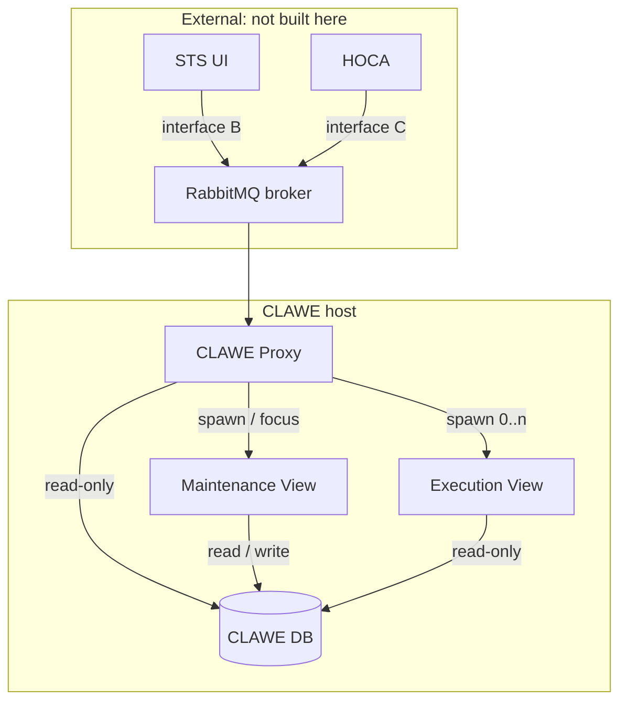
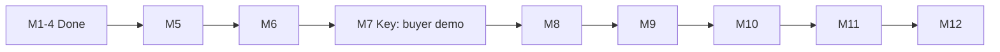
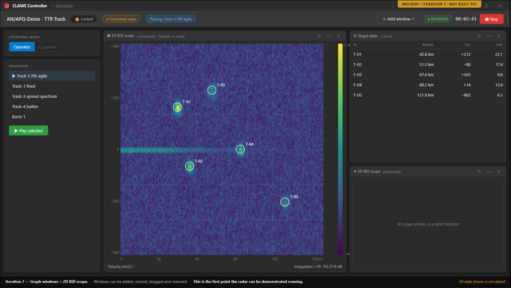
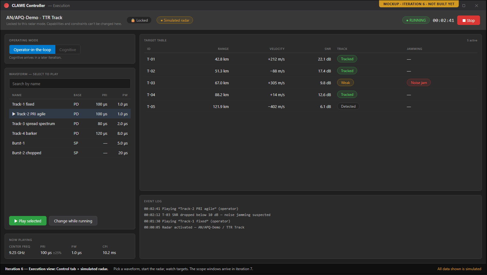
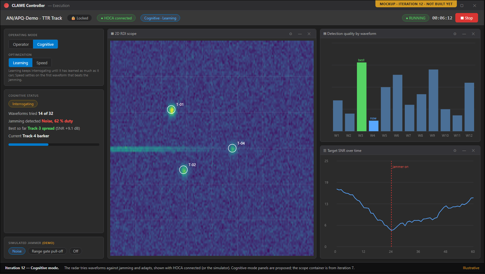

# CLAWE UI — Overview

> A standalone app for authoring and running closed-loop CLAWE radars, for operators and STS users.

**Version:** 1.0 · **Status:** Draft · **Updated:** 2026-10-01
**Derived from:** [DESIGN](DESIGN.md) v1.6 · [REQUIREMENTS](REQUIREMENTS.md) v1.6 · TASKS: [Iterative Timeline](CLAWE_UI_Iterative_Timeline.md) Draft v5 (stands in for TASKS.md) · [SPEC_REVIEW](SPEC_REVIEW.md) September 2026 (2nd pass, covers v1.1)

---

## 1. At a glance

| Milestones | Done | Requirements | Open decisions | Critical/High risks | Open Critical/High findings |
|---|---|---|---|---|---|
| 12 | 4 / 12 | 64 FR · 16 NFR | 14 | 9 (3 Critical · 6 High) | 0 |

## 2. What & why

A CLAWE radar is a closed-loop radar generator that adapts its transmitted waveform in response to jamming. CLAWE UI is a standalone C#/WPF application where operators author these radars (radar, modes, waveforms) and run them. STS fetches the radar catalogue over the network, and HOCA runs an assigned mode on STS hardware. It is built to look and feel like STS so STS users recognise it.

## 3. Scope

| In scope | Out of scope |
|---|---|
| Offline radar, mode and waveform authoring · [DESIGN §2](DESIGN.md) | CW waveform authoring · [REQUIREMENTS §6](REQUIREMENTS.md) |
| Field-range validation at point of entry · [DESIGN §2](DESIGN.md) | Radar mode types other than TTR · [REQUIREMENTS §6](REQUIREMENTS.md) |
| Live waveform metrics, browsable at scale · [DESIGN §2](DESIGN.md) | Being a PRISM plugin · [REQUIREMENTS §6](REQUIREMENTS.md) |
| Radar catalogue and change events to STS · [DESIGN §2](DESIGN.md) | Building HOCA, STEEM, SW Simulator, STS builder · [REQUIREMENTS §6](REQUIREMENTS.md) |
| Locked Execution View run for HOCA · [DESIGN §2](DESIGN.md) | Running the RabbitMQ broker · [REQUIREMENTS §6](REQUIREMENTS.md) |
| +1 more — see [DESIGN §2](DESIGN.md) | +5 more — see [REQUIREMENTS §6](REQUIREMENTS.md) |

## 4. Architecture

| Component | Responsibility (one line) | Design ref |
|---|---|---|
| CLAWE Proxy | Owns interfaces B and C; launches views | [DESIGN §5](DESIGN.md) |
| Maintenance View | Authors radars, modes, waveforms; sole database writer | [DESIGN §5](DESIGN.md) |
| Execution View | Runs one assigned radar mode, locked to it | [DESIGN §5](DESIGN.md) |
| CLAWE DB | Stores each radar as one blob plus a thin index | [DESIGN §5](DESIGN.md) |
| Waveform Calculation Engine (planned) | Computes five waveform metrics and a description | [DESIGN §5](DESIGN.md) |

## 5. Milestones

| # | Milestone | Outcome (demo-able at end) | Weeks | Status | Ref |
|---|---|---|---|---|---|
| 1–4 | Scaffolding · Mode editor · Waveform editor · Interface B + proxy | Radars, modes and waveforms are authored and saved, and STS-side requests work over RabbitMQ. | 1–8 | Done | [Timeline 1–4](CLAWE_UI_Iterative_Timeline.md) |
| 5 | Validation module + Waveform Calculation Engine | Every worked example in the calc deck passes as a unit test. | 9–10 | Planned | [Timeline 5](CLAWE_UI_Iterative_Timeline.md) |
| 6 | Simulated radar + Control tab | Pick a waveform, press Play, and watch simulated targets in a table. | 11–12 | Planned | [Timeline 6](CLAWE_UI_Iterative_Timeline.md) |
| 7 | Graph windows + 2D RDI scope | **Key:** the first build suitable for demos to potential buyers; a simulated radar runs live on the 2D RDI scope. | 13–14 | Planned | [Timeline 7](CLAWE_UI_Iterative_Timeline.md) |
| 8 | Waveform Summary Screen + editor layout rework | Every metric, the eclipsing chart and trade-offs update live as a waveform is built. | 15–16 | Planned | [Timeline 8](CLAWE_UI_Iterative_Timeline.md) |
| 9 | Live signal preview | The signal-shape preview updates live as modifiers are edited. | 17–18 | Planned | [Timeline 9](CLAWE_UI_Iterative_Timeline.md) |
| 10 | Rollups + Waveform browser | Thousands of waveforms can be filtered by name, parameter range and modulation type. | 19–20 | Planned | [Timeline 10](CLAWE_UI_Iterative_Timeline.md) |
| 11 | Interface C + real HOCA wiring | A mock or real HOCA launches the Execution View and streams data through interface C. | 21–22 | Planned | [Timeline 11](CLAWE_UI_Iterative_Timeline.md) |
| 12 | Cognitive mode + 3D RDI scope + polish | Full demo build runs cognitive mode against a simulated jammer or real HOCA. | 23–24 | Planned | [Timeline 12](CLAWE_UI_Iterative_Timeline.md) |

- Plan size: 12 iterations · ~24 weeks · ~480 hours at ~20 hrs/week · [Timeline](CLAWE_UI_Iterative_Timeline.md)

## 6. Key numbers

| Measure | Target | Ref |
|---|---|---|
| Whole-radar save latency | ≤ 500 ms for 2,000 waveforms | [NFR-1](REQUIREMENTS.md) |
| Waveform browser first page | ≤ 200 ms for 5,000 waveforms | [NFR-2](REQUIREMENTS.md) |
| Live metric and preview update | ≤ 100 ms after a field change | [NFR-3](REQUIREMENTS.md) |
| `RequestRadars()` response | ≤ 5 s for 500 radars | [NFR-4](REQUIREMENTS.md) |
| Proxy restart after unexpected exit | ≤ 30 s | [NFR-10](REQUIREMENTS.md) |
| Runnable demo build cadence | Every 2 weeks | [NFR-14](REQUIREMENTS.md) |
| +10 more — see [REQUIREMENTS §4](REQUIREMENTS.md) | | |

## 7. Top risks

| Risk (TASKS §5 risks + High/Critical failure modes) | Severity | Mitigation (one line) | Ref |
|---|---|---|---|
| Schema-update step fails mid-run | Critical | Each step is one transaction; app refuses to start | [DESIGN §9 FM-4](DESIGN.md) |
| Concurrent writers reach the database | Critical | Write-owner row checked before every commit | [DESIGN §9 FM-2](DESIGN.md) |
| RabbitMQ broker unreachable | Critical | STS shows source offline; reconnects with backoff | [DESIGN §9 FM-9](DESIGN.md) |
| Radar blob fails to deserialize | High | Radar stays listed; editor refuses and advises restore | [DESIGN §9 FM-3](DESIGN.md) |
| Second maintenance view starts | High | New process exits with a message; proxy returns FOCUSED | [DESIGN §9 FM-1](DESIGN.md) |
| Proxy cannot open the database | High | `RequestRadars()` returns an error with detail | [DESIGN §9 FM-5](DESIGN.md) |
| +3 more — see [DESIGN §9](DESIGN.md) (FM-10, FM-13, FM-14) | | | |

## 8. Open decisions

| Decision needed | Options (≤3, comma-separated) | Blocks | Ref |
|---|---|---|---|
| Can the deck author confirm the three ambiguous calc formulas? | none listed in source | M5 | [OQ-6](DESIGN.md) |
| Are waveform edits in an Execution View temporary, or saved? | Temporary (never saved), Saved via an exception to single-writer | M6 | [OQ-16](DESIGN.md) |
| Where is the STS "RTSA window" pattern, or do we ship a placeholder dock? | Locate the STS pattern, Placeholder container | M7 | [OQ-4](DESIGN.md) |
| How should ~1,024-pulse waveforms be drawn in previews? | Envelope/density, Decimated, Spectrogram (+2 more in source) | M7, M9 | [OQ-13](DESIGN.md) |
| Will a runnable HOCA exist to test against, and how does scope data reach the Execution View? | Real HOCA, Mocked HOCA | M11 | [OQ-3](DESIGN.md) |
| +9 more — see [DESIGN §10](DESIGN.md) | | | |

## 9. Spec health

| Critical | High | Medium | Low (open; n resolved) | Ready to build? |
|---|---|---|---|---|
| 0 | 0 (3 resolved) | 0 (8 resolved) | 0 (7 resolved) | Not re-validated — review covers v1.1, sources are v1.6 · [SPEC_REVIEW](SPEC_REVIEW.md) |

| Contradiction | Where | Ref |
|---|---|---|
| OQ-16 due "before iteration 9" vs. "before iteration 6" | [REQUIREMENTS §8.1](REQUIREMENTS.md) vs. [DESIGN §10](DESIGN.md) | OQ-16 |
| Traceability "still on old iteration numbers" vs. "remapped to Draft v5" | [Timeline](CLAWE_UI_Iterative_Timeline.md) vs. [REQUIREMENTS §7](REQUIREMENTS.md) | REQUIREMENTS §7 |
| Review says start at iteration 3 and counts 13 DD; timeline shows 1–4 done, DESIGN has 21 DD | [SPEC_REVIEW](SPEC_REVIEW.md) vs. [Timeline](CLAWE_UI_Iterative_Timeline.md), [DESIGN](DESIGN.md) | SPEC_REVIEW §1 |
| Timeline rows 3–4 cite preview in 7 and rollups in 8; table says 9 and 10 | within [Timeline](CLAWE_UI_Iterative_Timeline.md) | Timeline 3, 4 |

## 10. Visuals

## 11. Changelog

- **v1.0 — October 2026** — Initial draft.
