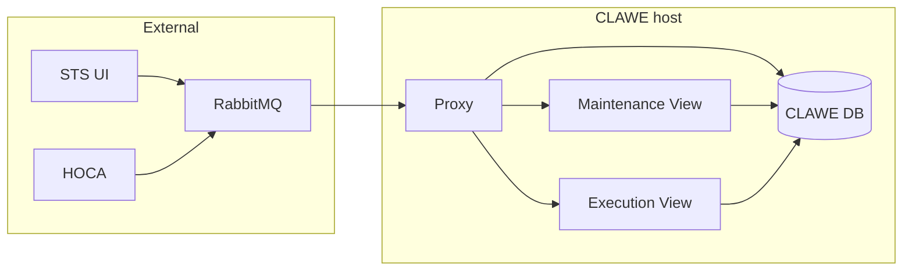
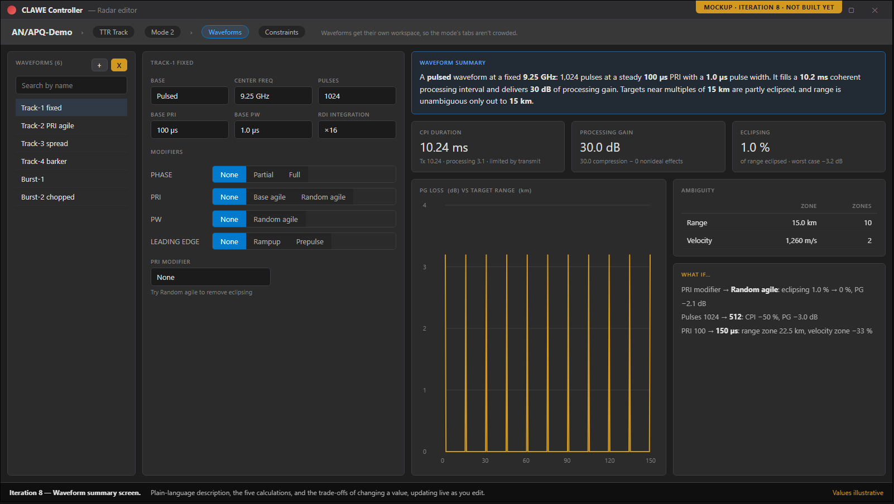

# CLAWE UI — Overview

> A standalone app for authoring and running closed-loop CLAWE radars, for the STS team and its buyers.

**Version:** 1.0 · **Status:** Draft · **Updated:** October 2026
**Derived from:** [DESIGN](DESIGN.md) v1.6 · [REQUIREMENTS](REQUIREMENTS.md) v1.6 · [TASKS](CLAWE_UI_Iterative_Timeline.md) = Iterative Timeline Draft v5 · [SPEC_REVIEW](SPEC_REVIEW.md) September 2026 (2nd pass)

---

## 1. At a glance

| Milestones | Done | Requirements | Open decisions | Critical/High risks | Open Critical/High findings |
|---|---|---|---|---|---|
| 12 | 4 / 12 | 64 FR · 16 NFR | 14 | 9 | 0 |

## 2. What & why

A CLAWE radar adapts its waveform in response to jamming, and STS has no way to author or run one. CLAWE UI lets an operator build these radars offline and run them, while STS fetches the catalogue over the network. The first build that shows a running (simulated) radar to potential buyers is iteration 7.

## 3. Scope

| In scope | Out of scope |
|---|---|
| Author radars, modes, waveforms ([DESIGN §2](DESIGN.md), [FR-12](REQUIREMENTS.md)) | CW waveform authoring ([REQUIREMENTS §6](REQUIREMENTS.md)) |
| Deck-range validation at entry ([DESIGN §2](DESIGN.md), [FR-13](REQUIREMENTS.md)) | Modes other than TTR ([DD-12](DESIGN.md)) |
| Live waveform metrics, 5 families ([DESIGN §2](DESIGN.md), [FR-26](REQUIREMENTS.md)) | PRISM plugin or shared assemblies ([DD-1](DESIGN.md)) |
| Radar catalogue to STS, interface B ([DESIGN §2](DESIGN.md), [FR-39](REQUIREMENTS.md)) | Building HOCA, STEEM, STS scenario builder ([DESIGN §2](DESIGN.md)) |
| Run a mode in Execution View, interface C ([DESIGN §2](DESIGN.md), [FR-49](REQUIREMENTS.md)) | Running the RabbitMQ broker ([DESIGN §2](DESIGN.md)) |
| +1 more — see [DESIGN §2](DESIGN.md) | +5 more — see [REQUIREMENTS §6](REQUIREMENTS.md) |

## 4. Architecture

| Component | Responsibility (one line) | Design ref |
|---|---|---|
| CLAWE Proxy | Owns interfaces B and C; launches views | [DESIGN §5](DESIGN.md) |
| Maintenance View | Authors radars; the only DB writer | [DESIGN §5](DESIGN.md) |
| Execution View | Runs one assigned radar mode, read-only | [DESIGN §5](DESIGN.md) |
| CLAWE DB | Stores radars as one blob plus index | [DESIGN §5](DESIGN.md) |
| Waveform Calculation Engine | Computes five waveform metric families (planned) | [DESIGN §5](DESIGN.md) |
| STS UI | Fetches radar catalogue over interface B | [DESIGN §4](DESIGN.md) |
| HOCA | Hardware layer; drives runs over interface C | [DESIGN §4](DESIGN.md) |
| RabbitMQ broker | Carries all interface B and C traffic | [DESIGN §4](DESIGN.md) |

## 5. Milestones

<!-- Caps in DESIGN_DOC_INSTRUCTIONS.md §12.4: collapse 3+ consecutive Done rows into one; mark one key row; end capped tables with "+N more — see <section>" -->

| # | Milestone | Outcome (demo-able at end) | Weeks | Status |
|---|---|---|---|---|
| 1–4 | Scaffolding, editors, interface B + proxy ([Timeline](CLAWE_UI_Iterative_Timeline.md)) | Author radars, modes, waveforms; STS fetches radar summaries over RabbitMQ. | 1–8 | Done |
| 5 | Validation module + calc engine ([Timeline](CLAWE_UI_Iterative_Timeline.md)) | Every worked example in the calc deck passes as a unit test. | 9–10 | Planned |
| 6 | Simulated radar + Control tab ([Timeline](CLAWE_UI_Iterative_Timeline.md)) | Pick a waveform, press Play, watch simulated targets in a table. | 11–12 | Planned |
| **7** <!-- row-key --> | **Graph windows + 2D RDI scope** ([Timeline](CLAWE_UI_Iterative_Timeline.md)) | **Key: first running (simulated) radar, the first build suitable for buyer demos.** | 13–14 | Planned |
| 8 | Waveform summary screen ([Timeline](CLAWE_UI_Iterative_Timeline.md)) | Metrics, eclipsing chart and trade-offs update live while editing. | 15–16 | Planned |
| 9 | Live signal preview ([Timeline](CLAWE_UI_Iterative_Timeline.md)) | Signal-shape preview updates live as modifiers change. | 17–18 | Planned |
| 10 | Rollups + waveform browser ([Timeline](CLAWE_UI_Iterative_Timeline.md)) | Filter thousands of waveforms by parameter, metric and modulation. | 19–20 | Planned |
| 11 | Interface C + real HOCA ([Timeline](CLAWE_UI_Iterative_Timeline.md)) | A mock or real HOCA launches an Execution View and streams data. | 21–22 | Planned |
| 12 | Cognitive mode, 3D scope, polish ([Timeline](CLAWE_UI_Iterative_Timeline.md)) | Full demo exe, ready for the 1.0.0 readiness pass. | 23–24 | Planned |

## 6. Key numbers

| Measure | Target | Ref |
|---|---|---|
| Whole-radar save, 2,000 waveforms | ≤ 500 ms | [NFR-1](REQUIREMENTS.md) |
| Waveform-browser first page, 5,000 waveforms | ≤ 200 ms | [NFR-2](REQUIREMENTS.md) |
| Summary and preview update after a field change | ≤ 100 ms | [NFR-3](REQUIREMENTS.md) |
| `RequestRadars()` response, 500 radars | ≤ 5 s | [NFR-4](REQUIREMENTS.md) |
| Proxy restart after unexpected exit | ≤ 30 s | [NFR-10](REQUIREMENTS.md) |
| Demo exe cadence | every 2 weeks | [NFR-14](REQUIREMENTS.md) |
| +10 more — see [REQUIREMENTS §4](REQUIREMENTS.md) | | |

## 7. Top risks

| Risk (TASKS §5 risks + High/Critical failure modes) | Severity | Mitigation (one line) | Ref |
|---|---|---|---|
| Execution View cannot open the database | High | Report failure to HOCA; no partial run starts. | [DESIGN §9 FM-13](DESIGN.md) |
| HOCA connection lost mid-run | High | Hold last state, show banner, stay open. | [DESIGN §9 FM-10](DESIGN.md) |
| HOCA rejects waveform or schedule load | High | Show rejection; refuse activation until a load succeeds. | [DESIGN §9 FM-14](DESIGN.md) |
| Concurrent writers reach the database | Critical | Write-owner check before every commit; others read-only. | [DESIGN §9 FM-2](DESIGN.md) |
| Schema-update step fails mid-run | Critical | Each step is one transaction; app refuses to start. | [DESIGN §9 FM-4](DESIGN.md) |
| RabbitMQ broker unreachable | Critical | STS shows source offline; reconnects with backoff. | [DESIGN §9 FM-9](DESIGN.md) |
| +3 more — see [DESIGN §9](DESIGN.md) | | | |

## 8. Open decisions

| Decision needed (Management-level first) | Owner | Options (≤3) | Blocks | Ref |
|---|---|---|---|---|
| Which reading of the three unclear calc formulas is correct? | Author of the calc deck | none listed | M5 | [DESIGN OQ-6](DESIGN.md) |
| Are operator waveform edits in a running view saved, or temporary? | Lead | Temporary (not saved), Exception to single-writer rule | M6 | [DESIGN OQ-16](DESIGN.md) |
| Do we find the STS "RTSA window" pattern, or ship a placeholder dock? | Not stated in source | Locate existing, Ship placeholder | M7 | [DESIGN OQ-4](DESIGN.md) |
| How should a ~1,024-pulse waveform be previewed? | Lead | Per-pulse, Envelope/density, Decimated (+2 in source) | M7, M9 | [DESIGN OQ-13](DESIGN.md) |
| Will a runnable HOCA exist for testing, and how does it send radar data? | HOCA owner; interface-deck author | Real HOCA, Mocked HOCA | M11 | [DESIGN OQ-3](DESIGN.md) |
| +9 more — see [DESIGN §10](DESIGN.md) | | | | |

## 9. Spec health

| Critical | High | Medium | Low (open; n resolved) | Ready to build? |
|---|---|---|---|---|
| 0 | 0 (3 resolved) | 0 (8 resolved) | 0 (7 resolved) | Not re-validated — review covers DESIGN v1.1, REQUIREMENTS v1.1, Timeline v4; sources are v1.6, v1.6, v5 |

Contradictions between documents (4 of 4 shown):

- Lead decision on Execution View waveform edits is due before M6 in [DESIGN OQ-16](DESIGN.md) but before iteration 9 in [REQUIREMENTS §8.1](REQUIREMENTS.md).
- Timeline Draft v5 says the traceability matrix still uses old iteration numbers; [REQUIREMENTS §7](REQUIREMENTS.md) v1.6 says it was remapped.
- [SPEC_REVIEW](SPEC_REVIEW.md) says begin at iteration 3; the [Timeline](CLAWE_UI_Iterative_Timeline.md) marks iterations 1–4 complete.
- Timeline iteration rows 3 and 4 cite old numbers (live preview "7", rollup layer "8"); Draft v5 uses 9 and 10.

## 10. Visuals

Mockups only; none of these screens is built yet.

*M6 — Control tab: pick a waveform, press Play, watch the target table.*

*M7 — Graph windows and 2D RDI scope: the first buyer-demo build.*

*M8 — Waveform summary: live metrics, eclipsing chart, trade-offs.*

## 11. Changelog

- **v1.0 — October 2026** — Initial draft.
