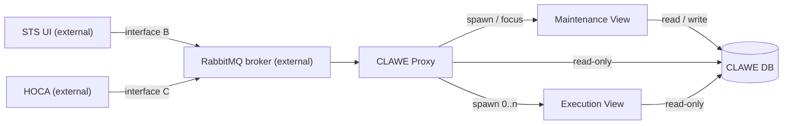

# CLAWE UI — Overview

> A standalone app for authoring and running closed-loop CLAWE radars, for STS users and radar-scenario operators.

**Version:** 1.0 · **Status:** Draft · **Updated:** 1 October 2026
**Derived from:** DESIGN v1.6 · REQUIREMENTS v1.6 · TASKS: none — [CLAWE_UI_Iterative_Timeline](CLAWE_UI_Iterative_Timeline.md) Draft v5 (30 Sep 2026) used in its place · SPEC_REVIEW September 2026, 2nd pass (covers DESIGN v1.1 / REQUIREMENTS v1.1 only)

---

## 1. At a glance

| Milestones | Done | Requirements | Open decisions | Critical/High risks | Open Critical/High findings |
|---|---|---|---|---|---|
| 12 | 4 / 12 | 64 FR · 16 NFR | 13 | 9 (3 Critical · 6 High) | 0 (review is stale — see §9) |

## 2. What & why

A CLAWE radar adapts its waveform in response to jamming, and today there is no standalone tool to author and run one. CLAWE UI lets an operator build radars, modes and waveforms with full validation, and lets STS add a live CLAWE radar to a static scenario over the network. The outcome is a 12-iteration, ~24-week build that reaches a buyer-demo (a simulated running radar) at iteration 7.

## 3. Scope

| In scope | Out of scope |
|---|---|
| Offline authoring of a full CLAWE radar ([DESIGN §2](DESIGN.md)) | Being a PRISM plugin or sharing its runtime ([DESIGN §2](DESIGN.md)) |
| Field ranges enforced at entry ([DESIGN §2](DESIGN.md)) | CW waveform authoring in v1 ([OQ-7](DESIGN.md)) |
| Live waveform metrics, browsable at scale ([DESIGN §2](DESIGN.md)) | Radar modes other than TTR in v1 ([DD-12](DESIGN.md)) |
| Radar catalogue to STS over interface B ([DESIGN §2](DESIGN.md)) | Building HOCA, STEEM, SPARTA simulator, STS builder ([DESIGN §2](DESIGN.md)) |
| Locked Execution View run via interface C ([DESIGN §2](DESIGN.md)) | Running the RabbitMQ broker ([DESIGN §2](DESIGN.md)) |
| Look and feel matching STS ([DESIGN §2](DESIGN.md)) | Multi-host maintenance-edit coordination ([DESIGN §2](DESIGN.md)) |
| | General emitter tool (stays in PRISM EmitterBuilder) ([DESIGN §2](DESIGN.md)) |

## 4. Architecture

| Component | Responsibility (one line) | Design ref |
|---|---|---|
| CLAWE Proxy | Owns interface B and C connections; launches views | [DESIGN §5](DESIGN.md) |
| Maintenance View | Authors radars, modes, waveforms; sole DB writer | [DESIGN §5](DESIGN.md) |
| Execution View | Runs one assigned radar mode; never writes DB | [DESIGN §5](DESIGN.md) |
| CLAWE DB | SQLite store: protobuf blob per radar plus index | [DESIGN §5](DESIGN.md) |
| Waveform Calculation Engine | Computes five waveform metric families (planned) | [DESIGN §5](DESIGN.md) |
| STS UI (external) | Client on interface B | [DESIGN §4](DESIGN.md) |
| HOCA (external) | Hardware-abstraction layer; drives interface C | [DESIGN §4](DESIGN.md) |
| RabbitMQ broker (external) | Carries all interface B and C traffic | [DESIGN §4](DESIGN.md) |

## 5. Milestones

| # | Milestone | Outcome (demo-able at end) | Weeks | Status | Ref |
|---|---|---|---|---|---|
| 1 | Scaffolding, DB and Radar CRUD | Themed exe; radars persist across relaunch. | 1–2 | Done | [M1](CLAWE_UI_Iterative_Timeline.md) |
| 2 | Radar mode editor and visualization spike | Author a full validated TTR mode with a themed pulse-train chart. | 3–4 | Done | [M2](CLAWE_UI_Iterative_Timeline.md) |
| 3 | Waveform editor and schema extension | Author a complete validated waveform that round-trips through the blob. | 5–6 | Done | [M3](CLAWE_UI_Iterative_Timeline.md) |
| 4 | Interface B and proxy restructure | Fetch radars, launch editor and get modified-events over RabbitMQ from a test client. | 7–8 | Done | [M4](CLAWE_UI_Iterative_Timeline.md) |
| 5 | Domain validation and Waveform Calculation Engine | Every deck worked example reproduced by a passing unit test. | 9–10 | Planned | [M5](CLAWE_UI_Iterative_Timeline.md) |
| 6 | Simulated radar and Execution View Control tab | Run a mode, press Play, watch simulated targets in the table. | 11–12 | Planned | [M6](CLAWE_UI_Iterative_Timeline.md) |
| 7 | Graph-window container and 2D RDI scope | Running simulated radar with live 2D RDI scope; first buyer-demo build. | 13–14 | Planned | [M7](CLAWE_UI_Iterative_Timeline.md) |
| 8 | Waveform Summary Screen and editor layout rework | Every metric, eclipsing chart and trade-off updates live. | 15–16 | Planned | [M8](CLAWE_UI_Iterative_Timeline.md) |
| 9 | Live signal preview | Signal-shape preview updates live as modifiers change. | 17–18 | Planned | [M9](CLAWE_UI_Iterative_Timeline.md) |
| 10 | Rollup infrastructure and Waveform browser | Filter thousands of waveforms; radar overlay gains Freq/PRI filters. | 19–20 | Planned | [M10](CLAWE_UI_Iterative_Timeline.md) |
| 11 | Interface C and real HOCA wiring | Mock or real HOCA launches and streams a waveform via interface C. | 21–22 | Planned | [M11](CLAWE_UI_Iterative_Timeline.md) |
| 12 | Cognitive mode, 3D RDI scope and polish | Full demo exe, authoring through cognitive run, no known validation gaps. | 23–24 | Planned | [M12](CLAWE_UI_Iterative_Timeline.md) |

No `T-*` task IDs exist in the source; milestones link to the timeline's iteration rows. Durations: 2-week iterations, ~20 hrs/week ([Timeline](CLAWE_UI_Iterative_Timeline.md)).

## 6. Key numbers

| Measure | Target | Ref |
|---|---|---|
| Whole-radar save, 2,000 waveforms | ≤ 500 ms | [NFR-1](REQUIREMENTS.md) |
| Waveform-browser first page, 5,000 waveforms | ≤ 200 ms, zero blob reads | [NFR-2](REQUIREMENTS.md) |
| Summary and preview recompute after field change | ≤ 100 ms | [NFR-3](REQUIREMENTS.md) |
| `RequestRadars()` deadline, 500 radars | 5 s | [NFR-4](REQUIREMENTS.md) |
| Proxy restart after unexpected exit | ≤ 30 s | [NFR-10](REQUIREMENTS.md) |
| Radar-modified event debounce / latency bound | 250 ms / ≤ 1 s | [FR-43](REQUIREMENTS.md) |
| Design catalogue size | 500 radars | [DESIGN §3](DESIGN.md) |
| Delivery size | 12 iterations, ~24 weeks, ~480 hours | [Timeline](CLAWE_UI_Iterative_Timeline.md) |

## 7. Top risks

Risks are DESIGN §9 failure modes rated High or Critical (9 of 14); the timeline has no severity-rated risk section.

| Risk | Severity | Mitigation (one line) | Ref |
|---|---|---|---|
| Concurrent writers reach CLAWE DB | Critical | Write-owner row checked before every commit; others read-only | [DESIGN §9 FM-2](DESIGN.md) |
| Schema-update step fails mid-run | Critical | Per-step transaction; app refuses to start with diagnostic | [DESIGN §9 FM-4](DESIGN.md) |
| RabbitMQ broker unreachable | Critical | STS shows source offline, reconnects with backoff | [DESIGN §9 FM-9](DESIGN.md) |
| Second Maintenance View attempts to start | High | Mutex detected; new process exits or returns `FOCUSED` | [DESIGN §9 FM-1](DESIGN.md) |
| Radar blob fails to deserialize | High | Listed from index; editor refuses to open, suggests restore | [DESIGN §9 FM-3](DESIGN.md) |
| Proxy cannot open CLAWE DB | High | `RequestRadars()` returns an error response with detail | [DESIGN §9 FM-5](DESIGN.md) |
| Execution View loses HOCA connection mid-run | High | Holds last state, shows banner; HOCA re-sends activate | [DESIGN §9 FM-10](DESIGN.md) |
| Execution View cannot open CLAWE DB | High | Reports failure to HOCA; no partial run starts | [DESIGN §9 FM-13](DESIGN.md) |
| HOCA rejects `LoadWaveforms` / `LoadSchedule` | High | Shows rejection; activation refused until valid load | [DESIGN §9 FM-14](DESIGN.md) |

## 8. Open decisions

| Decision needed | Options (≤3, comma-separated) | Blocks | Ref |
|---|---|---|---|
| RabbitMQ broker ownership in deployment | Not stated in source | M12 packaging; interface-B reviews | [OQ-1](DESIGN.md) |
| HOCA test instance and interface-C telemetry stream | Real HOCA, mocked HOCA | M11 | [OQ-3](DESIGN.md) |
| Locate STS "RTSA window" pattern | Find existing pattern, placeholder dock container | M7 | [OQ-4](DESIGN.md) |
| Calc-engine formula ambiguities | Not stated in source | M5 | [OQ-6](DESIGN.md) |
| CW waveform authoring | Not stated in source (future deck) | CW editor (deferred) | [OQ-7](DESIGN.md) |
| `modulation_types` covers 6 of 9 categories | Intended, omission | FR-40 | [OQ-8](DESIGN.md) |
| Blob storage granularity | One blob per radar, per-waveform blob rows | M10 (revisit) | [OQ-9](DESIGN.md) |
| Second maintenance launch behaviour | Focus, reject | FR-44 (lead sign-off) | [OQ-10](DESIGN.md) |
| Proxy multi-PC identity and discovery | Not stated in source | Nothing stated | [OQ-11](DESIGN.md) |
| Preview rendering for ~1,024-pulse trains | Per-pulse, envelope/density, decimated (+2 more) | M7, M9 | [OQ-13](DESIGN.md) |
| `LoadWaveforms` scope | Active radar, active radar mode | M11 | [OQ-14](DESIGN.md) |
| Waveform-parameter gaps and legacy range conflicts | Not stated in source | FR-13 | [OQ-15](DESIGN.md) |
| Execution View waveform edits vs single writer | Transient edits, exception to single-writer rule | M6 (demo avoids it) | [OQ-16](DESIGN.md) |

## 9. Spec health

Counts are from SPEC_REVIEW (2nd pass), which reviewed DESIGN v1.1 / REQUIREMENTS v1.1. The sources are now v1.6 and have not been re-reviewed.

| Critical | High | Medium | Low (open; n resolved) | Ready to build? |
|---|---|---|---|---|
| 0 | 0 (3 resolved) | 0 (8 resolved) | 0 (6 resolved) | Not re-validated — review predates DESIGN/REQUIREMENTS v1.2–v1.6 |

Contradictions found while deriving this overview (reported, not resolved):

| Item | Conflict | Ref |
|---|---|---|
| OQ-16 deadline | DESIGN says decide before iteration 6; REQUIREMENTS says before iteration 9 | [OQ-16](DESIGN.md) · [REQUIREMENTS §8.1](REQUIREMENTS.md) |
| OQ-12 status | Iteration Review lists it resolved; DESIGN register does not mark it resolved | [OQ-12](DESIGN.md) · [Iteration Review](Iteration_Review.md) |
| Traceability remap | Timeline says matrix still uses old iteration numbers; REQUIREMENTS v1.6 says it was remapped | [Timeline](CLAWE_UI_Iterative_Timeline.md) · [REQUIREMENTS §7](REQUIREMENTS.md) |
| Stale counts | SPEC_REVIEW cites 63 FR and 13 DD; sources now hold 64 FR and 21 DD | [SPEC_REVIEW](SPEC_REVIEW.md) |

## 10. Changelog

- **v1.0 — October 2026** — Initial draft, derived from DESIGN v1.6, REQUIREMENTS v1.6, the iteration timeline Draft v5 and SPEC_REVIEW (2nd pass).
