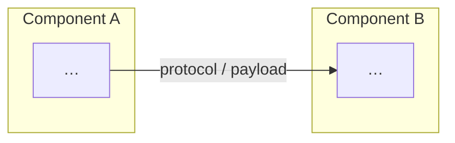
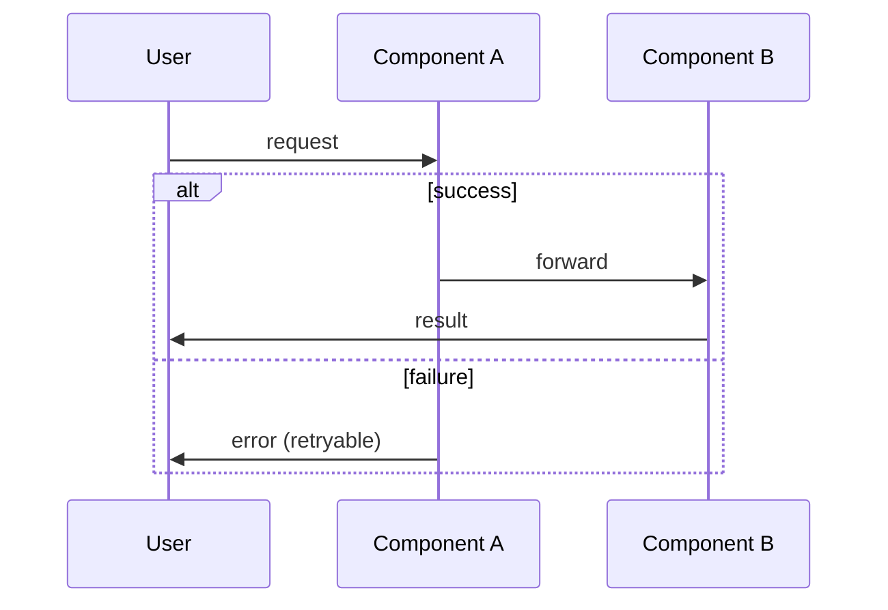

# <Project / Feature> — Design

> One line: what this covers and which components talk to which.

**Version:** 1.0 · **Status:** Draft · **Updated:** <Month Year>

---

## 1. Overview

<2–4 paragraphs: the problem, the cast of **components** (bold on first mention),
how this document relates to `REQUIREMENTS.md` and `TASKS.md`.>

## 2. Goals & non-goals

**Goals**
- <specific, falsifiable>

**Non-goals**
- <explicitly out, so scope stays bounded>

## 3. Context & constraints

- **Existing system:** <what is already there, real module/file paths>
- **Platform / scale:** <targets — requests/s, data volume, users>
- **Hard constraints:** <language, framework, compliance, deadlines>
- **Assumptions:** <each one that, if wrong, changes the design>

## 4. Architecture

<Prose walking the diagram. Every box and edge above is also described here.>

## 5. Components

### <Component A>
- **Responsibility:** <one sentence>
- **Interfaces:** <exposes … / consumes …>
- **Owns:** <data / state>

### <Component B>
- **Responsibility:** …

## 6. Key flows

### <Flow name>

<Prose restating the flow, including the failure branch.>

## 7. Design decisions

### DD-1 — <decision>
**Decision:** <what was chosen>
**Rationale:** <why>
**Alternatives considered:**

| Option | Pro | Con | Verdict |
|---|---|---|---|
| <chosen> | … | … | chosen |
| <rejected> | … | … | rejected — <reason> |

**Consequences:** <what this makes easy / hard later>

### DD-2 — …

## 8. Data model

<Entities, fields, relationships. Delete this section if not applicable.>

## 9. Failure modes & recovery

| Failure | Trigger | Severity | Recovery | Handling |
|---|---|---|---|---|
| FM-1 <name> | <what causes it> | Critical / High / Medium / Low | Abort / Retry / Resume / Degrade | <what the system does> |

<Total: N failure modes.>

## 10. Open questions

1. <question> — resolved by <who / what>.

## 11. Changelog

- **v1.0 — <Month Year>** — Initial draft.
