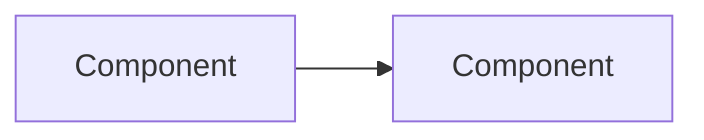

# <Project / Feature> — Overview

> One line: what this is and who it is for.

**Version:** 1.0 · **Status:** Draft · **Updated:** <Month Year>
**Derived from:** DESIGN v<x> · REQUIREMENTS v<x> · TASKS v<x> · SPEC_REVIEW <date>

---

## 1. At a glance

| Milestones | Done | Requirements | Open decisions | Critical/High risks | Open spec findings |
|---|---|---|---|---|---|
| <n> | <n> / <n> | <n> FR · <n> NFR | <n> | <n> | <n> |

## 2. What & why

<2–3 sentences. Problem, who benefits, the outcome. No history.>

## 3. Scope

| In scope | Out of scope |
|---|---|
| <headline> | <headline> |

## 4. Architecture

| Component | Responsibility (one line) | Design ref |
|---|---|---|
| <name> | <headline> | [§5](DESIGN.md) |

## 5. Milestones

| # | Milestone | Outcome (demo-able at end) | Tasks | Status |
|---|---|---|---|---|
| 1 | <name> | <one sentence> | T-1–T-3 | Planned |

```mermaid
gantt
    dateFormat X
    axisFormat %s
    section Build
    M1 <name> :m1, 0, 2
```

## 6. Key numbers

| Measure | Target | Ref |
|---|---|---|
| <NFR headline> | <value + unit> | NFR-1 |

## 7. Top risks

| Risk | Severity | Mitigation (one line) | Ref |
|---|---|---|---|
| <headline> | High | <headline> | DESIGN §9 |

## 8. Open decisions

| Decision needed | Options (≤3, comma-separated) | Blocks | Ref |
|---|---|---|---|
| <headline> | <A>, <B> | M2 | DESIGN §10 |

## 9. Spec health

| Critical | High | Medium | Low | Ready to build? |
|---|---|---|---|---|
| <n> | <n> | <n> | <n> | Yes / No — <reason> |

## 10. Changelog

- **v1.0 — <Month Year>** — Initial draft.
