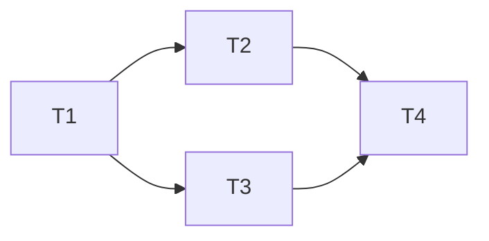

# <Project / Feature> — Implementation Tasks

> One line: what gets built and in what order.

**Version:** 1.0 · **Status:** Draft · **Updated:** <Month Year>

---

## 1. Overview

<Links to [`DESIGN.md`](DESIGN.md) (v<x>) and [`REQUIREMENTS.md`](REQUIREMENTS.md)
(v<x>). One paragraph on the build strategy — what order, and why.>

## 2. Milestones

| Milestone | Demoable increment | Tasks | Status |
|---|---|---|---|
| M1 <name> (≤6 words) | <one sentence: what works at the end of it> | T-1, T-2, T-3 | Planned |
| M2 <name> | … | T-4, T-5 | Planned |

Status is `Planned` / `In progress` / `Done`; detail such as release tags and review history belongs in the task or changelog, not this table.

## 3. Tasks

### T-1 — <short title>
**Goal:** <what this task delivers>
**Touches:** `<path>`, `<path>`, `<test path>`
**Depends on:** <task IDs, or "none">
**Satisfies:** <FR / NFR IDs>
**Acceptance:** <checkable without later tasks>
**Size:** S / M (never L — an L-sized task means split it before it lands here)

### T-2 — …

## 4. Dependency graph

## 5. Risks & mitigations

| Risk | Impact | Mitigation |
|---|---|---|
| <unknown / external blocker / uncovered requirement> | … | … |

## 6. Changelog

- **v1.0 — <Month Year>** — Initial draft.
